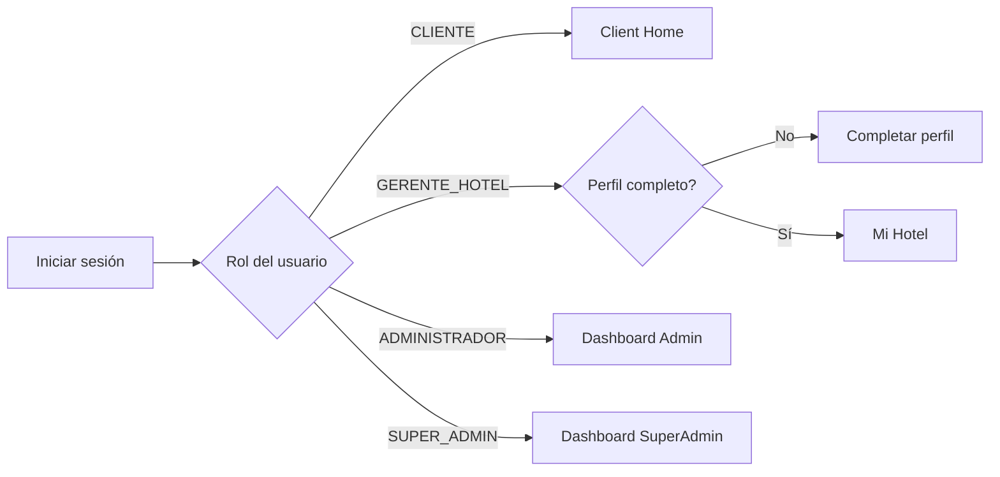
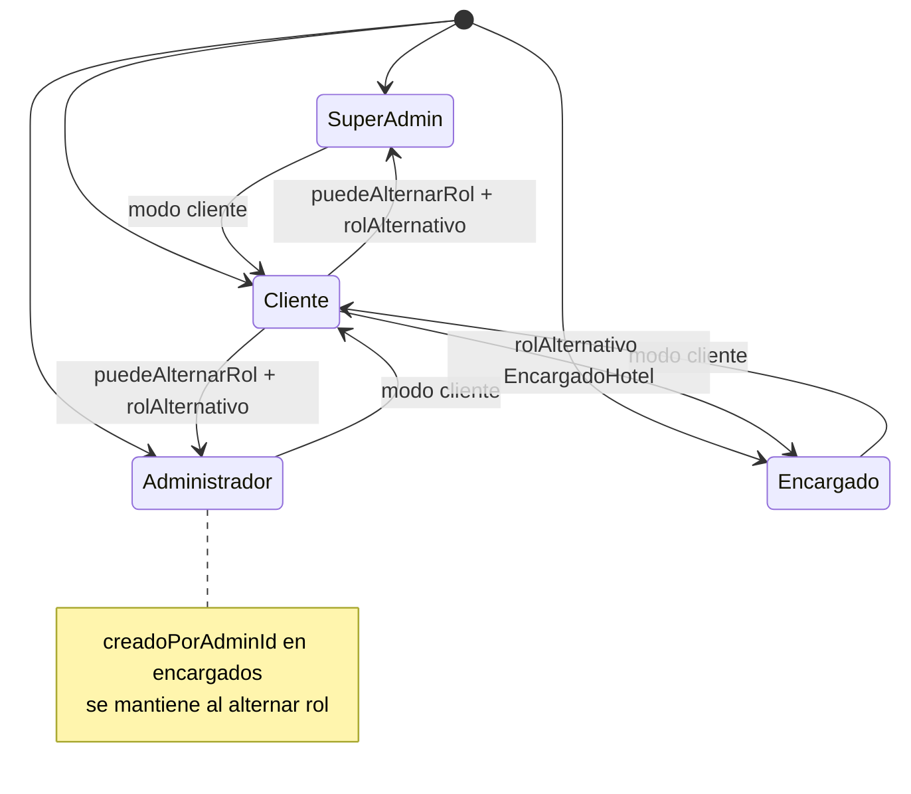

# 1. Actores y diagrama general

## Actores

| Actor | Rol en código | Descripción |
|-------|---------------|-------------|
| **Invitado** | Sin sesión | Splash, login, registro, recuperar contraseña |
| **Cliente** | `UserRole.CLIENTE` | Busca hoteles, reserva, paga, reseñas, perfil |
| **Encargado de hotel** | `UserRole.GERENTE_HOTEL` | Gestiona su hotel (máx. 1), habitaciones, stock, reservas y comentarios |
| **Administrador** | `UserRole.ADMINISTRADOR` | Supervisa encargados que creó; consulta hoteles/habitaciones/reservas de su red |
| **SuperAdmin** | `UserRole.SUPER_ADMIN` | Control total: CRUD global, administradores, auditoría, comentarios por hotel |
| **Firebase** | Secundario | Auth, Firestore, Storage |
| **Pasarela simulada** | Secundario | Validación local de tarjeta (sin procesador real) |

---

## Diagrama general de casos de uso

```mermaid
flowchart TB
    subgraph actores [Actores humanos]
        INV((Invitado))
        CLI((Cliente))
        ENC((Encargado de hotel))
        ADM((Administrador))
        SA((SuperAdmin))
    end

    subgraph externos [Sistemas externos]
        FB[[Firebase]]
        PAY[[Pasarela simulada]]
    end

    subgraph sistema [Sistema Selva Booking]

        subgraph auth [Autenticación]
            UC01[UC-01 Iniciar sesión]
            UC02[UC-02 Registrarse]
            UC03[UC-03 Recuperar contraseña]
            UC04[UC-04 Cerrar sesión]
            UC05[UC-05 Completar perfil encargado]
            UC06[UC-06 Alternar rol]
        end

        subgraph cliente [Módulo Cliente]
            UC10[UC-10 Explorar hoteles]
            UC11[UC-11 Reservar y pagar]
            UC12[UC-12 Mis reservas]
            UC13[UC-13 Comentar hotel]
            UC14[UC-14 Mi cuenta]
        end

        subgraph encargado [Módulo Encargado]
            UC20[UC-20 Gestionar mi hotel]
            UC21[UC-21 Gestionar habitaciones y stock]
            UC22[UC-22 Historial de reservas]
            UC23[UC-23 Ver comentarios de huéspedes]
        end

        subgraph adminLim [Administrador limitado]
            UC30[UC-30 Ver dashboard supervisión]
            UC31L[UC-31 Consultar hoteles de su red]
            UC32L[UC-32 Consultar reservas de su red]
            UC33L[UC-33 Gestionar encargados creados]
        end

        subgraph superAdmin [SuperAdmin]
            UC30S[UC-30s Dashboard global]
            UC31S[UC-31s CRUD hoteles + filtro por admin]
            UC32S[UC-32s CRUD reservas globales]
            UC33S[UC-33s Gestionar encargados]
            UC34[UC-34 Gestionar administradores]
            UC35[UC-35 Auditoría y respaldos]
            UC36[UC-36 Ver comentarios por hotel]
        end

        UC99[UC-99 Soporte y FAQ]
    end

    INV --> UC01 & UC02 & UC03
    CLI --> UC04 & UC10 & UC11 & UC12 & UC13 & UC14 & UC99
    ENC --> UC04 & UC05 & UC06 & UC20 & UC21 & UC22 & UC23 & UC14 & UC99
    ADM --> UC04 & UC06 & UC30 & UC31L & UC32L & UC33L & UC14 & UC99
    SA --> UC04 & UC06 & UC30S & UC31S & UC32S & UC33S & UC34 & UC35 & UC36 & UC14 & UC99

    UC01 & UC02 & UC03 & UC04 & UC05 --> FB
    UC10 & UC11 & UC12 & UC13 & UC14 --> FB
    UC20 & UC21 & UC22 & UC23 --> FB
    UC30 & UC31L & UC32L & UC33L --> FB
    UC30S & UC31S & UC32S & UC33S & UC34 & UC35 & UC36 --> FB
    UC11 --> PAY

    UC11 -.->|extend| UC10
    UC23 -.->|extend| UC20
    UC36 -.->|extend| UC31S
    UC35 -.->|extend| UC20
```

---

## Destino tras login

---

## Alternar rol (triple toque en tipo de cuenta)

---

## UC-02 Registrarse — validaciones

| Campo | Regla | Implementación |
|-------|-------|----------------|
| Nombre | Mín. 3 caracteres, solo letras y espacios | `ValidationUtils.isValidName()` |
| Email | Formato válido | `ValidationUtils.isValidEmail()` |
| Teléfono | Exactamente 9 dígitos numéricos | `ValidationUtils.isValidPhone()` |
| Contraseña | Mín. 6 caracteres, confirmación igual | `ValidationUtils.isValidPassword()` |

---

## Leyenda UML

| Símbolo | Significado |
|---------|-------------|
| `(Actor)` | Persona o sistema externo |
| `[Caso de uso]` | Funcionalidad del sistema |
| `-->` | Asociación actor → caso de uso |
| `-.->\|extend\|` | Flujo opcional |
| `-->\|include\|` | Subproceso obligatorio |
