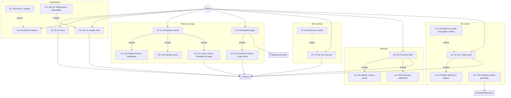
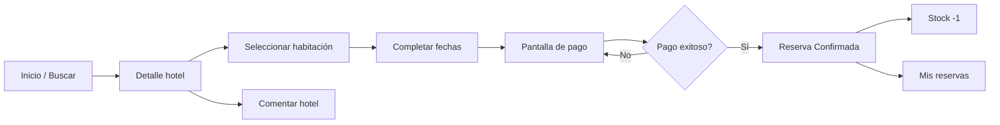

# 2. Módulo Cliente

## Diagrama de casos de uso — Cliente

---

## Flujo principal del cliente

---

## Tabla de casos de uso

| ID | Caso de uso | Descripción | Pantalla / ruta |
|----|-------------|-------------|-----------------|
| UC-10 | Ver inicio | Hoteles destacados y ofertas | `CLIENT_HOME` |
| UC-10a | Buscar hoteles | Búsqueda por ciudad, precio, categoría | `CLIENT_SEARCH` |
| UC-10b | Filtrar y ordenar | Filtros en pantalla de búsqueda | `CLIENT_SEARCH` |
| UC-10c | Ver detalle hotel | Galería, servicios, calificación | `HOTEL_DETAIL/{id}` |
| UC-10d | Ver habitaciones | Solo tipos con stock > 0 | `HOTEL_DETAIL/{id}` |
| UC-11 | Completar reserva | Fechas, huéspedes, habitación | `BOOKING/{hotelId}/{roomId}` |
| UC-11c | Crear reserva | Estado interno `AWAITING_PAYMENT` | `BOOKING` → `PAYMENT` |
| UC-11d | Realizar pago | Formulario tarjeta simulado | `PAYMENT/{reservationId}` |
| UC-11e | Confirmar reserva | Pasa a `CONFIRMADA`, decrementa stock | `PaymentViewModel` |
| UC-12 | Ver mis reservas | Listado en tiempo real | `CLIENT_RESERVATIONS` |
| UC-13 | Comentar hotel | Requiere al menos 1 reserva en el hotel | `HOTEL_DETAIL` |
| UC-14 | Mi cuenta | Perfil, foto, teléfono | `CLIENT_PROFILE` |
| UC-14a | Alternar rol | Encargado / Admin / SuperAdmin ↔ Cliente | `ProfileScreen` |

---

## Registro previo (Invitado → Cliente)

El registro (UC-02) ocurre antes del módulo cliente pero define el perfil inicial:

| Campo | Validación |
|-------|------------|
| Nombre | Solo letras y espacios, mín. 3 |
| Teléfono | Solo dígitos, exactamente 9 |
| Email / contraseña | Estándar Firebase Auth |
