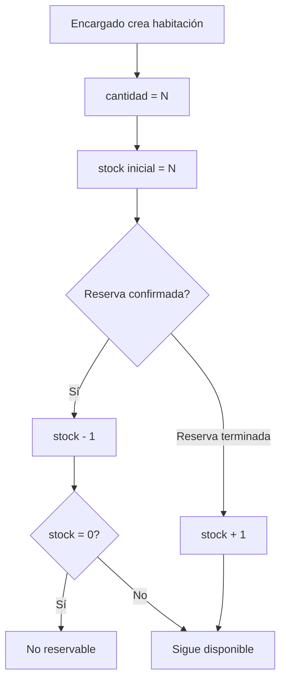

# 3. Módulo Encargado de hotel

> Rol en código: `UserRole.GERENTE_HOTEL` · UI: **Encargado del hotel**

## Diagrama de casos de uso — Encargado

```mermaid
flowchart TB
    ENC((Encargado de hotel))
    FB[[Firebase]]

    subgraph onboarding [Primer acceso]
        UC05[UC-05 Completar perfil encargado]
        UC05A[UC-05a Validar datos obligatorios]
    end

    subgraph hotel [Mi hotel]
        UC20[UC-20 Gestionar mi hotel]
        UC20A[UC-20a Registrar hotel]
        UC20B[UC-20b Editar hotel]
        UC20C[UC-20c Eliminar hotel]
        UC20D[UC-20d Subir imágenes hotel]
    end

    subgraph rooms [Habitaciones]
        UC21[UC-21 Gestionar habitaciones]
        UC21A[UC-21a Registrar habitación]
        UC21B[UC-21b Editar habitación y cantidad]
        UC21C[UC-21c Eliminar habitación]
        UC21D[UC-21d Control de stock]
    end

    subgraph reservas [Historial reservas]
        UC22[UC-22 Ver historial de reservas]
        UC22A[UC-22a Filtrar Confirmada / Terminada]
        UC22B[UC-22b Buscar por cliente o habitación]
        UC22C[UC-22c Ver contadores totales]
        UC22D[UC-22d Ver detalle reserva]
    end

    subgraph comentarios [Comentarios]
        UC23[UC-23 Ver comentarios de huéspedes]
        UC23A[UC-23a Listado en tiempo real]
    end

    ENC --> UC05 & UC20 & UC21 & UC22 & UC23
    UC05 -->|include| UC05A
    UC20A & UC20B & UC20C -.->|extend| UC20
    UC20B & UC20A -->|include| UC20D
    UC21A & UC21B & UC21C -.->|extend| UC21
    UC21B -->|include| UC21D
    UC22A & UC22B & UC22C & UC22D -.->|extend| UC22
    UC23A -.->|extend| UC23

    UC05 & UC20 & UC21 & UC22 & UC23 --> FB
```

---

## Reglas de negocio del encargado

---

## Restricciones

| Regla | Descripción |
|-------|-------------|
| Un hotel por encargado | Máximo 1 hotel activo (`MAX_HOTELS_PER_GERENTE = 1`) |
| Solo su hotel | Solo edita hoteles donde `propietarioId == user.id` |
| Calificación fija | Calificación base asignada al crear hotel (no editable por encargado) |
| Reservas visibles | Solo `CONFIRMADA` y `TERMINADA` de su hotel |
| Auditoría | Cambios en hotel/habitación registrados en `AuditLog` |
| Vínculo admin | `User.creadoPorAdminId` asignado al crear la cuenta |

---

## Tabla de casos de uso

| ID | Caso de uso | Pantalla / ruta |
|----|-------------|-----------------|
| UC-05 | Completar perfil | `GERENTE_COMPLETE_PROFILE` |
| UC-20 | Gestionar mi hotel | `MANAGER_HOTELS` |
| UC-21 | Gestionar habitaciones | `ADMIN_ROOMS/{hotelId}` |
| UC-22 | Historial de reservas | `MANAGER_RESERVATIONS` |
| UC-23 | Ver comentarios | `MANAGER_REVIEWS` |
