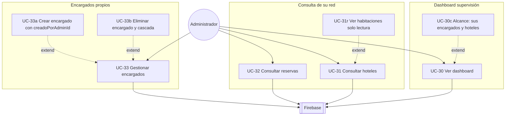
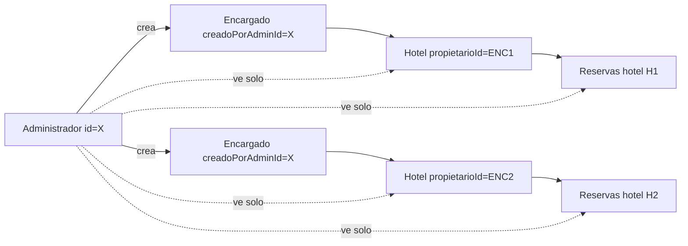

# 4. Módulo Administrador y SuperAdmin

> Existen **dos roles de panel admin** con permisos distintos. El **SuperAdmin** tiene control total; el **Administrador** supervisa solo la red de encargados que él creó.

## Diagrama — SuperAdmin

```mermaid
flowchart TB
    SA((SuperAdmin))
    FB[[Firebase]]

    subgraph dashboard [Dashboard global]
        UC30S[UC-30s Ver dashboard]
        UC30A[UC-30a Métricas ingresos y reservas]
        UC30B[UC-30b Comentarios / sin encargado / sin admin]
    end

    subgraph hoteles [Hoteles y habitaciones]
        UC31S[UC-31s Gestionar todos los hoteles]
        UC31A[UC-31a CRUD hotel]
        UC31F[UC-31f Filtrar por administrador]
        UC31G[UC-31g Ver encargado y administrador]
        UC31C[UC-31c CRUD habitaciones y stock]
        UC36[UC-36 Ver comentarios del hotel]
    end

    subgraph reservas [Reservas globales]
        UC32S[UC-32s Gestionar reservas]
        UC32A[UC-32a Crear reserva manual]
        UC32B[UC-32b Editar / eliminar]
        UC32C[UC-32c Filtrar y buscar]
        UC32D[UC-32d Terminar reserva]
    end

    subgraph cuentas [Cuentas del sistema]
        UC33S[UC-33s Gestionar encargados]
        UC34[UC-34 Gestionar administradores]
    end

    subgraph auditoria [Auditoría]
        UC35[UC-35 Registro y respaldos]
        UC35A[UC-35a Revertir cambios de encargado]
    end

    SA --> UC30S & UC31S & UC32S & UC33S & UC34 & UC35 & UC36
    UC31A & UC31F & UC31G & UC31C & UC36 -.->|extend| UC31S
    UC32A & UC32B & UC32C & UC32D -.->|extend| UC32S
    UC35A -.->|extend| UC35
    UC30S & UC31S & UC32S & UC33S & UC34 & UC35 & UC36 --> FB
```

---

## Diagrama — Administrador (limitado)

---

## Permisos comparados

| Área | SuperAdmin | Administrador | Encargado |
|------|:----------:|:-------------:|:---------:|
| Dashboard global / supervisión | ✓ global | ✓ su red | — |
| CRUD hoteles | ✓ todos | Solo lectura (su red) | ✓ 1 hotel propio |
| CRUD habitaciones | ✓ todos | Solo lectura | ✓ su hotel |
| CRUD reservas | ✓ todas | Solo lectura (su red) | Historial propio |
| Ver comentarios | ✓ por hotel (⭐) | — | ✓ su hotel |
| Filtrar hoteles por admin | ✓ | — | — |
| Gestionar encargados | ✓ todos | ✓ los que creó | — |
| Gestionar administradores | ✓ | — | — |
| Auditoría / revertir | ✓ | — | — |
| Alternar a modo cliente | ✓ | ✓ | ✓ |

---

## Alcance del Administrador (`AdminDataScope`)

---

## Tabla de casos de uso y rutas

| ID | Caso de uso | Rol | Pantalla / ruta |
|----|-------------|-----|-----------------|
| UC-30 | Ver dashboard | Admin / SuperAdmin | `ADMIN_DASHBOARD` |
| UC-31 | Gestionar / consultar hoteles | SuperAdmin / Admin | `ADMIN_HOTELS` |
| UC-31c | Gestionar habitaciones | SuperAdmin / Admin (lectura) | `ADMIN_ROOMS/{hotelId}` |
| UC-32 | Gestionar / consultar reservas | SuperAdmin / Admin | `ADMIN_RESERVATIONS` |
| UC-33 | Gestionar encargados | SuperAdmin / Admin | `ADMIN_GERENTES` |
| UC-34 | Gestionar administradores | SuperAdmin | `ADMIN_ADMINISTRADORES` |
| UC-35 | Auditoría y respaldos | SuperAdmin | `ADMIN_AUDIT` |
| UC-36 | Comentarios por hotel | SuperAdmin | `ADMIN_HOTEL_REVIEWS/{hotelId}` |
