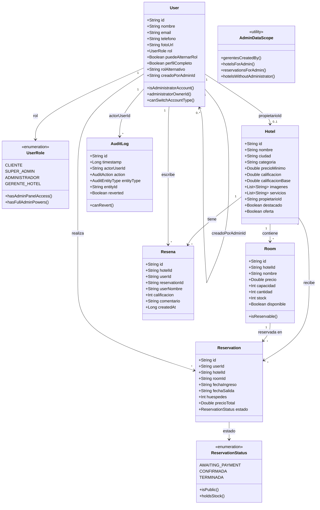
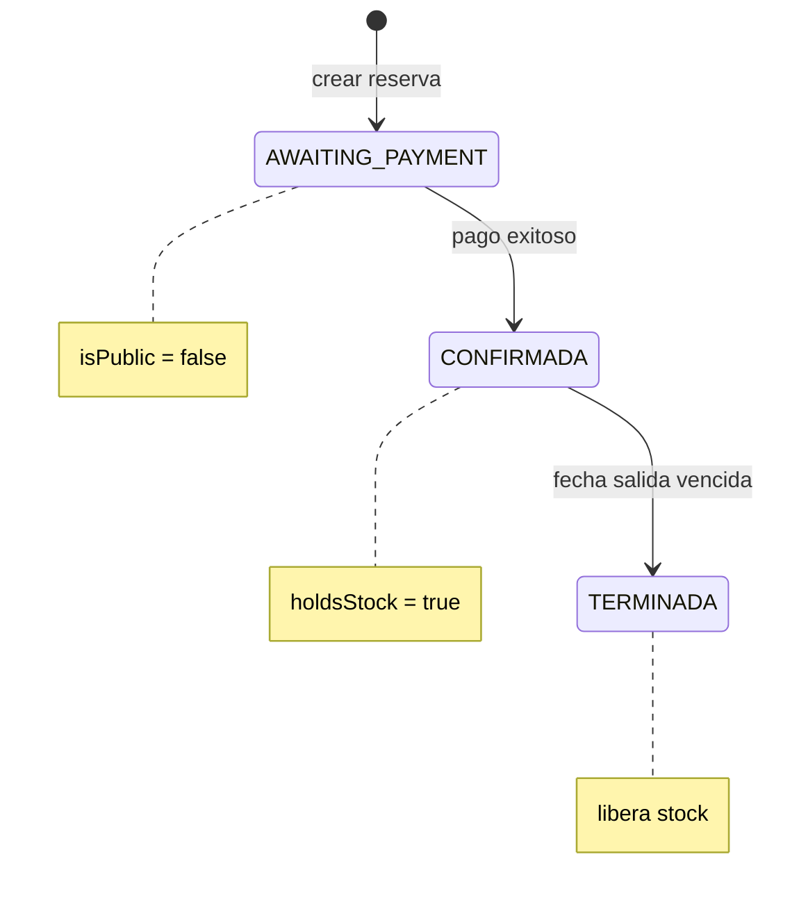

# 5. Diagrama de clases — Dominio

Modelo principal en `domain/model/`. Utilidades de alcance en `utils/AdminDataScope.kt`.

---

## Relaciones clave

| Relación | Cardinalidad | Campo / regla |
|----------|--------------|---------------|
| Administrador → Encargado | 1..* | `User.creadoPorAdminId` |
| Encargado → Hotel | 0..1 | `Hotel.propietarioId` (máx. 1 hotel) |
| Hotel → Room | 1..* | `Room.hotelId` |
| Cliente → Reservation | 0..* | `Reservation.userId` |
| Room → stock | — | `stock` baja en CONFIRMADA, sube en TERMINADA |
| Encargado → AuditLog | 0..* | Cambios en hotel/habitación |

---

## Enumeración ReservationStatus

