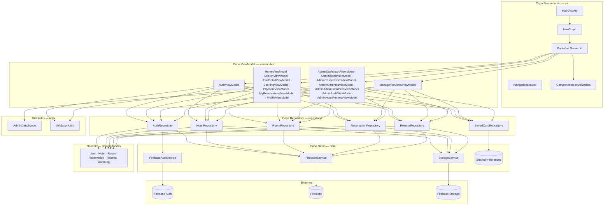
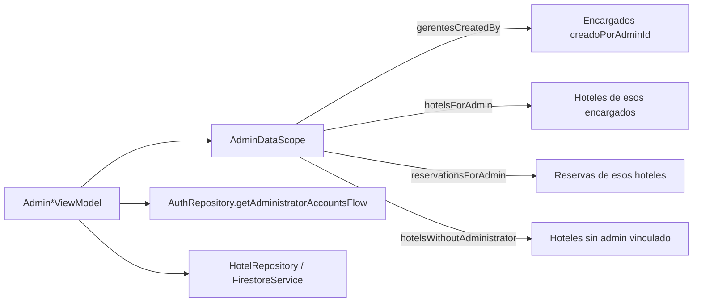
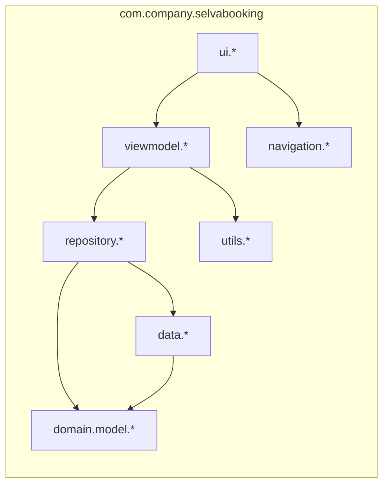
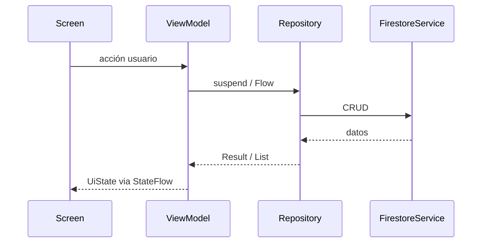
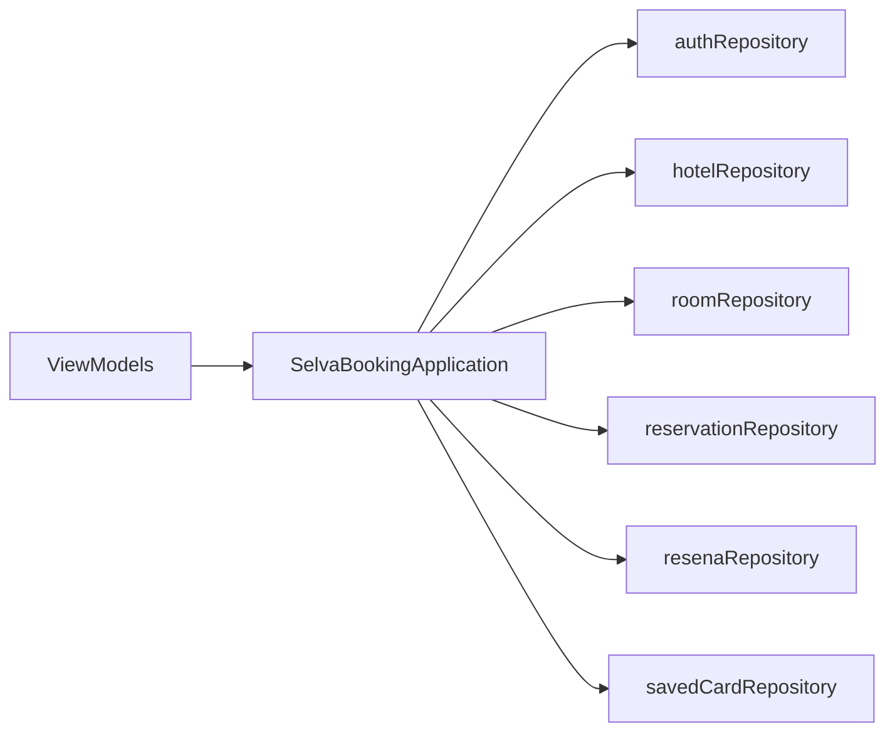

# 6. Arquitectura MVVM

## Diagrama de componentes

---

## ViewModels por módulo

| Módulo | ViewModel | Pantalla principal |
|--------|-----------|-------------------|
| Auth | `AuthViewModel` | Login, Registro, Recuperar contraseña |
| Cliente | `HomeViewModel`, `SearchViewModel`, `HotelDetailViewModel` | Inicio, búsqueda, detalle |
| Reserva | `BookingViewModel`, `PaymentViewModel` | Reserva, pago |
| Cliente | `MyReservationsViewModel`, `ProfileViewModel` | Mis reservas, perfil |
| Encargado | `AdminHotelsViewModel`*, `AdminReservationsViewModel`*, `ManagerReviewsViewModel` | Mi hotel, reservas, comentarios |
| SuperAdmin / Admin | `AdminDashboardViewModel`, `AdminHotelsViewModel`, `AdminReservationsViewModel`, `AdminGerentesViewModel`, `AdminAdministradoresViewModel`, `AdminAuditViewModel`, `AdminHotelReviewsViewModel` | Panel admin |

\* Reutilizados con alcance distinto según rol (`AdminDataScope` para administrador limitado).

---

## AdminDataScope — filtrado por red

---

## Diagrama de paquetes

---

## Flujo de datos (unidireccional)

---

## SelvaBookingApplication

