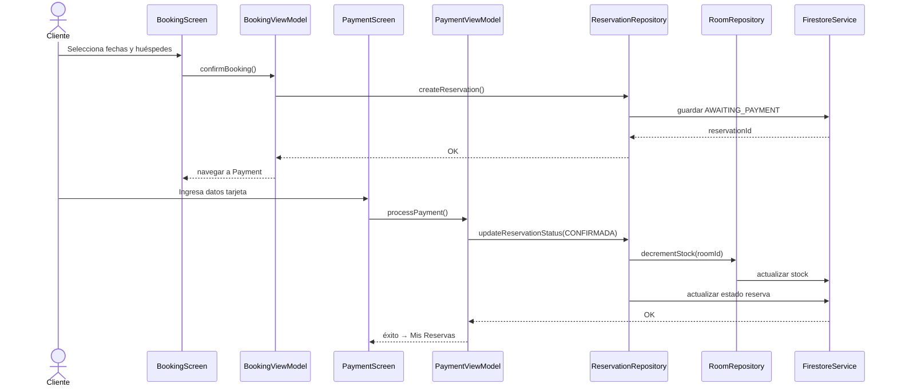
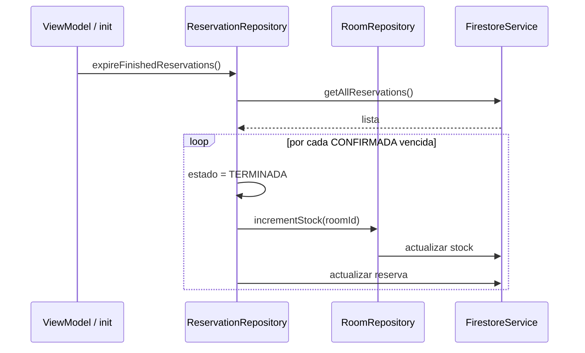
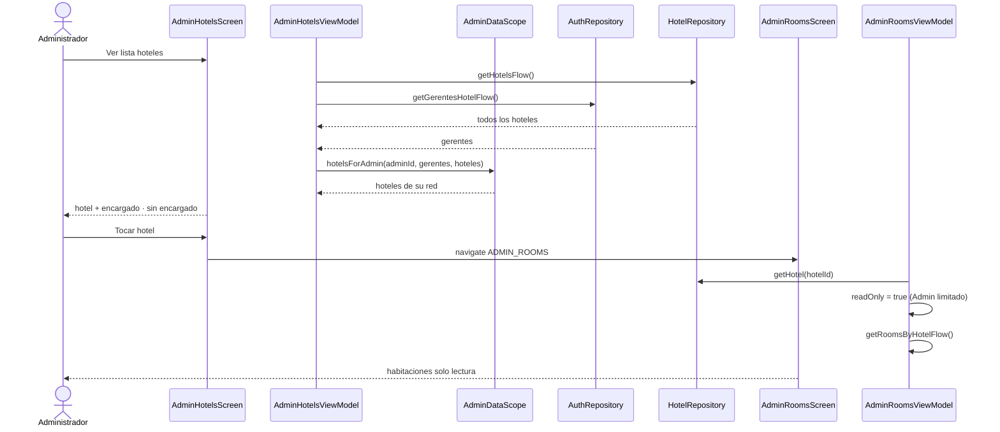
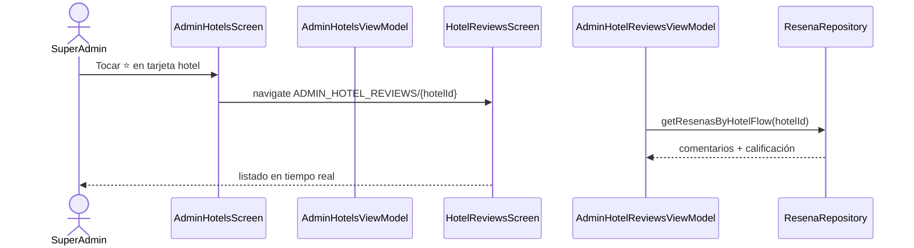
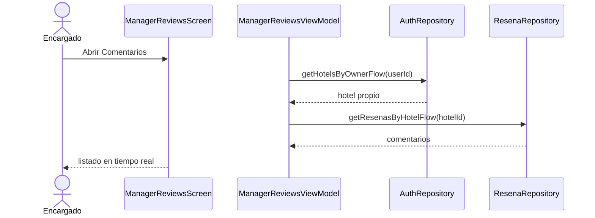

# 7. Diagrama de secuencia — Reserva y pago

## Flujo completo: reservar habitación

---

## Expiración automática de reservas

---

## Admin consulta hotel y habitaciones

---

## SuperAdmin ve comentarios por hotel

---

## Encargado ve comentarios de su hotel

