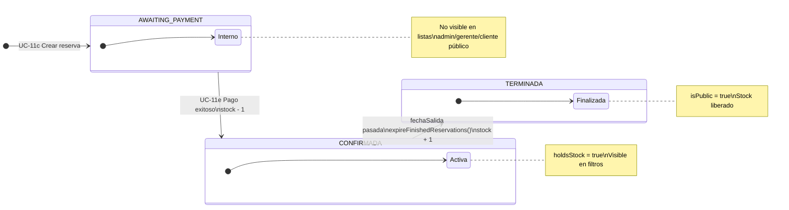
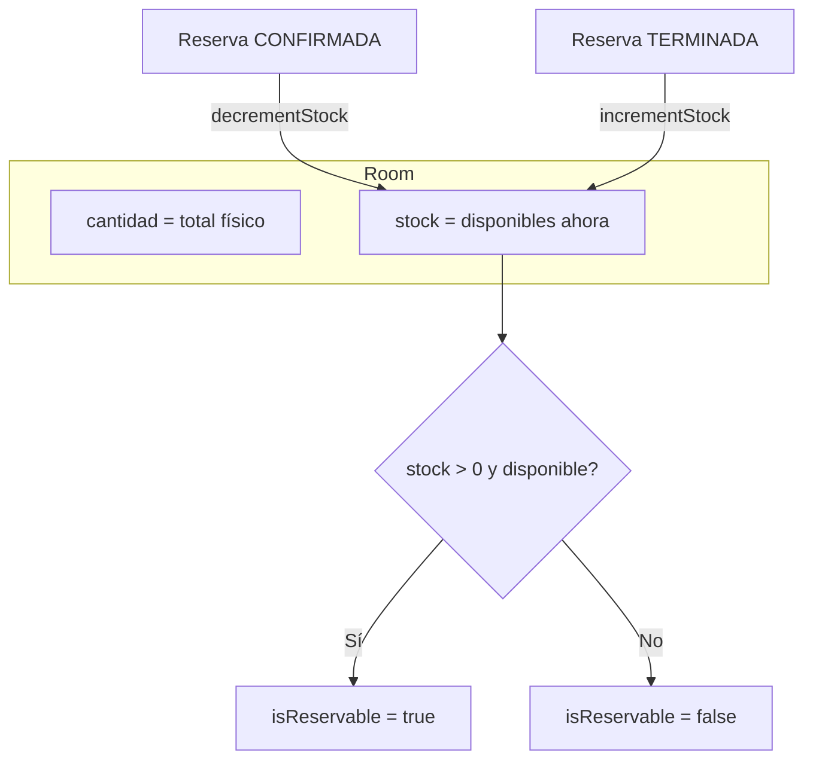

# 8. Estados de reserva

## Máquina de estados

---

## Visibilidad por rol

| Estado | Cliente (Mis reservas) | Admin / SuperAdmin | Encargado |
|--------|:----------------------:|:------------------:|:---------:|
| AWAITING_PAYMENT | Durante flujo de pago | No | No |
| CONFIRMADA | Sí | Sí (Admin: su red) | Sí (su hotel) |
| TERMINADA | Sí | Sí (Admin: su red) | Sí (su hotel) |

---

## Impacto en stock de habitación

---

## Transiciones en código

| Transición | Clase / método |
|------------|----------------|
| → AWAITING_PAYMENT | `ReservationRepository.createReservation()` |
| → CONFIRMADA | `ReservationRepository.updateReservationStatus()` + `RoomRepository.decrementStock()` |
| → TERMINADA | `ReservationRepository.expireFinishedReservations()` + `RoomRepository.incrementStock()` |
