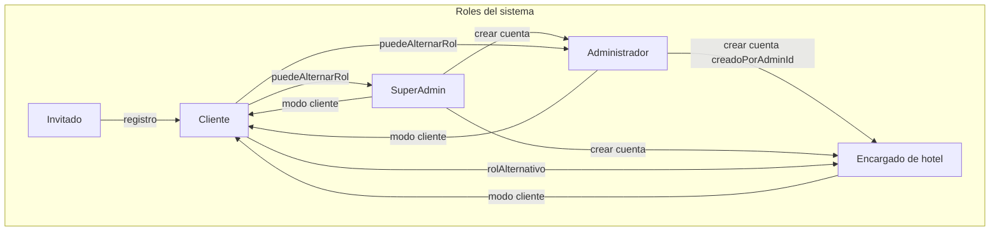

# 9. Matriz actor × módulo

## Acceso por actor

| Módulo / funcionalidad | Invitado | Cliente | Encargado | Administrador | SuperAdmin |
|------------------------|:--------:|:-------:|:---------:|:-------------:|:----------:|
| Splash / Login / Registro | ● | ○ | ○ | ○ | ○ |
| Registro con teléfono (9 dígitos) | ● | — | — | — | — |
| Explorar y buscar hoteles | — | ● | ○ | — | — |
| Reservar y pagar | — | ● | — | — | — |
| Mis reservas | — | ● | — | — | — |
| Reseñas (escribir) | — | ● | — | — | — |
| Mi cuenta / perfil | — | ● | ● | ● | ● |
| Alternar rol ↔ cliente | — | ○ | ● | ● | ● |
| Completar perfil encargado | — | — | ● | — | — |
| Gestionar mi hotel (CRUD) | — | — | ● | — | — |
| Gestionar habitaciones y stock | — | — | ● | — | — |
| Historial reservas de su hotel | — | — | ● | — | — |
| Ver comentarios de su hotel | — | — | ● | — | — |
| Dashboard supervisión (su red) | — | — | — | ● | — |
| Dashboard global | — | — | — | — | ● |
| Consultar hoteles (su red) | — | — | — | ● | — |
| CRUD hoteles (todos) | — | — | — | — | ● |
| Filtrar hoteles por administrador | — | — | — | — | ● |
| Ver comentarios por hotel | — | — | — | — | ● |
| Consultar habitaciones (lectura) | — | — | — | ● | — |
| CRUD habitaciones (global) | — | — | — | — | ● |
| Consultar reservas (su red) | — | — | — | ● | — |
| CRUD reservas (global) | — | — | — | — | ● |
| Crear / eliminar encargados (propios) | — | — | — | ● | — |
| Gestionar todos los encargados | — | — | — | — | ● |
| Gestionar administradores | — | — | — | — | ● |
| Auditoría y revertir cambios | — | — | — | — | ● |
| Soporte y FAQ | ○ | ● | ● | ● | ● |

**Leyenda:** ● acceso directo · ○ acceso indirecto o condicional · — no aplica

---

## Diagrama de roles y cuentas

---

## Pantallas por rol (NavGraph)

| Rol | Rutas principales |
|-----|-------------------|
| Cliente | `CLIENT_HOME`, `CLIENT_SEARCH`, `CLIENT_RESERVATIONS`, `CLIENT_PROFILE` |
| Encargado | `MANAGER_HOTELS`, `MANAGER_RESERVATIONS`, `MANAGER_REVIEWS`, `MANAGER_PROFILE` |
| Administrador | `ADMIN_DASHBOARD`, `ADMIN_HOTELS`, `ADMIN_RESERVATIONS`, `ADMIN_GERENTES`, `ADMIN_PROFILE` |
| SuperAdmin | `ADMIN_DASHBOARD`, `ADMIN_HOTELS`, `ADMIN_HOTEL_REVIEWS/{id}`, `ADMIN_RESERVATIONS`, `ADMIN_GERENTES`, `ADMIN_ADMINISTRADORES`, `ADMIN_AUDIT`, `ADMIN_PROFILE` |

---

## Firebase — colecciones usadas

| Colección | Entidad | Roles que leen/escriben |
|-----------|---------|-------------------------|
| `users` | User | Todos (según reglas) |
| `hotels` | Hotel | Cliente lee; Encargado CRUD propio; SuperAdmin CRUD; Admin lee su red |
| `rooms` | Room | Cliente lee; Encargado CRUD; SuperAdmin CRUD; Admin lee su red |
| `reservations` | Reservation | Cliente propias; Encargado filtradas; SuperAdmin CRUD; Admin lee su red |
| `resenas` | Resena | Cliente CRUD propias; Encargado/SuperAdmin leen |
| `audit_logs` | AuditLog | SuperAdmin lee/revierte; Encargado genera al editar |
