# Selva Booking — Diagramas UML (v1 — histórico)

> **Documentación actualizada:** usa [`docs/diagramas-v2/`](../diagramas-v2/00_INDICE.md) (Jul 2026).  
> Incluye SuperAdmin, Administrador limitado, `creadoPorAdminId`, comentarios, auditoría y validaciones de registro.

**Proyecto:** Selva Booking · Android · Kotlin · Jetpack Compose · Firebase  
**Fuente:** Elaboración propia  
**Total:** 70 casos de uso · 5 actores · 4 módulos  
**Versión documento:** 2026 (v1 — conservado como referencia)

> Abre este archivo con **Preview** (`Ctrl + Shift + V`) para ver todos los diagramas Mermaid.

---

## Índice

1. [Leyenda UML](#1-leyenda-uml)
2. [Actores](#2-actores)
3. [Diagrama general](#3-diagrama-general)
4. [Módulo Autenticación (UC-01 – UC-10)](#4-módulo-autenticación-uc-01--uc-10)
5. [Módulo Cliente (UC-11 – UC-37)](#5-módulo-cliente-uc-11--uc-37)
6. [Módulo Cliente — Reseñas (UC-67 – UC-69)](#6-módulo-cliente--reseñas-uc-67--uc-69)
7. [Módulo Administrador (UC-38 – UC-65)](#7-módulo-administrador-uc-38--uc-65)
8. [Diagrama UML clásico — Cliente](#8-diagrama-uml-clásico--cliente)
9. [Diagrama UML clásico — Administrador](#9-diagrama-uml-clásico--administrador)
10. [Relaciones include / extend](#10-relaciones-include--extend)
11. [Matriz actor × módulo](#11-matriz-actor--módulo)
12. [Archivos PlantUML](#12-archivos-plantuml)

---

## 1. Leyenda UML

| Símbolo | Significado |
|---------|-------------|
| `(Actor)` | Actor humano o sistema externo |
| `[Casos de uso]` | Óvalo / nodo de caso de uso |
| `<<include>>` | Subproceso **obligatorio** |
| `<<extend>>` | Flujo **opcional** |
| Frontera del sistema | Rectángulo que delimita Selva Booking |
| Paquete interno | Agrupación temática de casos |
| Hub central | Caso de uso principal que especializa el módulo |

---

## 2. Actores

| Actor | Tipo | Descripción |
|-------|------|-------------|
| **Invitado** | Primario | Sin sesión. Splash, login, registro, recuperar contraseña. |
| **Cliente** | Primario | Rol `CLIENTE`. Busca, reserva, paga, comenta y gestiona perfil. |
| **Administrador** | Primario | Rol `ADMINISTRADOR`. Gestiona catálogo, reservas y solicitudes. |
| **Firebase** | Secundario | Auth, Firestore y Storage. |
| **Pasarela simulada** | Secundario | Validación local de tarjeta (sin procesador real). |

---

## 3. Diagrama general

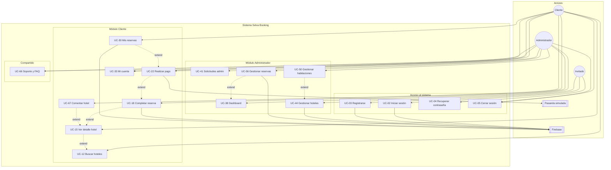

---

## 4. Módulo Autenticación (UC-01 – UC-10)

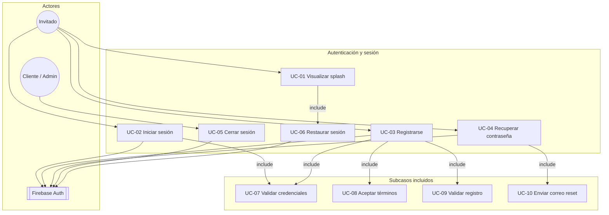

| ID | Caso de uso | Actor | Descripción |
|----|-------------|-------|-------------|
| UC-01 | Visualizar splash | Invitado | Pantalla de bienvenida al abrir la app. |
| UC-02 | Iniciar sesión | Invitado | Acceso con email y contraseña. |
| UC-03 | Registrarse | Invitado | Creación de cuenta nueva. |
| UC-04 | Recuperar contraseña | Invitado | Enlace de restablecimiento por email. |
| UC-05 | Cerrar sesión | Cliente, Admin | Cierre de sesión Firebase. |
| UC-06 | Restaurar sesión | Sistema | Redirección si hay sesión activa. |
| UC-07 | Validar credenciales | Sistema | Validación de email y contraseña. |
| UC-08 | Aceptar términos | Invitado | Lectura obligatoria antes de registrarse. |
| UC-09 | Validar registro | Sistema | Validación de campos del formulario. |
| UC-10 | Enviar correo reset | Sistema | Email vía Firebase Auth. |

---

## 5. Módulo Cliente (UC-11 – UC-37)

### 5.1 Exploración (UC-11 – UC-17)

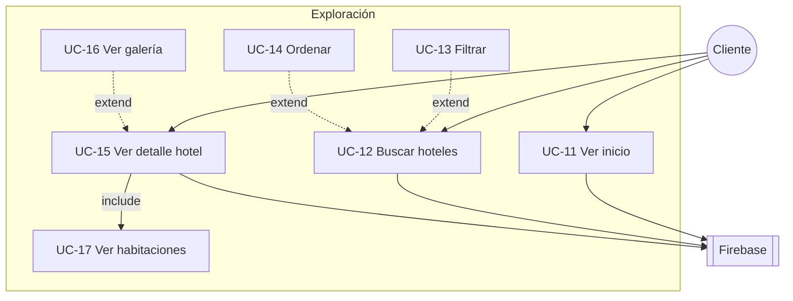

### 5.2 Reserva y pago (UC-18 – UC-32)

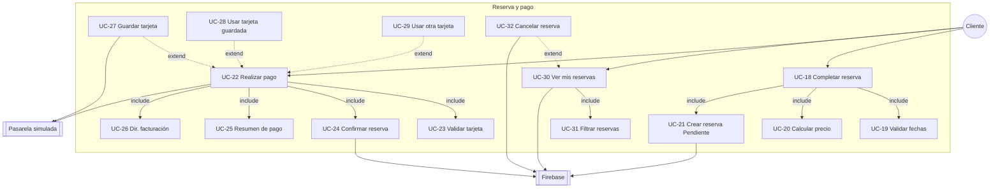

**Flujo principal cliente**

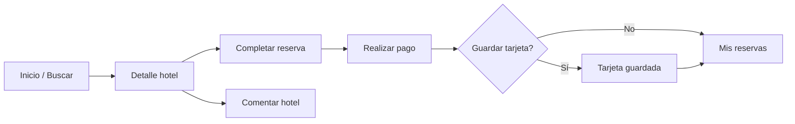

| ID | Caso de uso | Descripción |
|----|-------------|-------------|
| UC-18 | Completar reserva | Fechas y huéspedes. |
| UC-19 | Validar fechas | Fechas y capacidad. |
| UC-20 | Calcular precio | Noches × precio. |
| UC-21 | Crear reserva | Estado **Pendiente** en Firestore. |
| UC-22 | Realizar pago | Pasarela simulada. |
| UC-23 | Validar tarjeta | 16 dígitos, MM/AA, CVC, facturación. |
| UC-24 | Confirmar reserva | Estado **Confirmada**. |
| UC-25 | Resumen de pago | Hotel, fechas, total. |
| UC-26 | Dir. facturación | Distrito Madre de Dios y código postal. |
| UC-27 | Guardar tarjeta | Post-pago, almacenamiento local. |
| UC-28 | Usar tarjeta guardada | Pago solo con CVC. |
| UC-29 | Usar otra tarjeta | Formulario completo alternativo. |
| UC-30 | Ver mis reservas | Listado personal en tiempo real. |
| UC-31 | Filtrar reservas | Por estado. |
| UC-32 | Cancelar reserva | Cancelación del cliente. |

### 5.3 Mi cuenta, método de pago y soporte (UC-33 – UC-37, UC-66, UC-70)

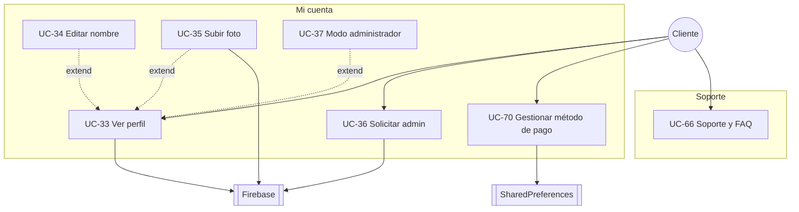

| ID | Caso de uso | Descripción |
|----|-------------|-------------|
| UC-33 | Ver perfil | Nombre, email, foto, rol. |
| UC-34 | Editar nombre | Actualizar en Firestore. |
| UC-35 | Subir foto | Firebase Storage. |
| UC-36 | Solicitar admin | Solicitud de acceso admin. |
| UC-37 | Modo administrador | Si `puedeAlternarRol`. |
| UC-66 | Soporte y FAQ | Preguntas frecuentes. |
| UC-70 | Gestionar método de pago | Agregar, modificar o eliminar tarjeta en perfil. |

---

## 6. Módulo Cliente — Reseñas (UC-67 – UC-69)

> Solo usuarios con **al menos una reserva** en el hotel pueden comentar.

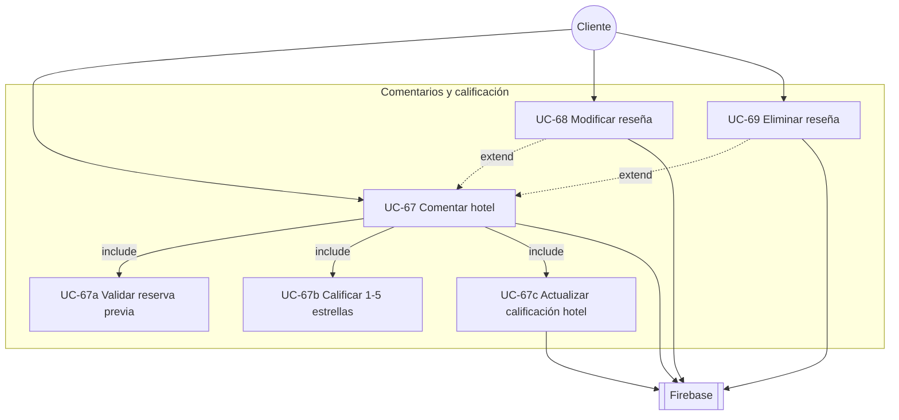

| ID | Caso de uso | Descripción |
|----|-------------|-------------|
| UC-67 | Comentar hotel | Escribir reseña con estrellas (1–5) y texto. |
| UC-67a | Validar reserva previa | Verifica al menos 1 reserva en el hotel. |
| UC-67b | Calificar 1–5 estrellas | Selector visual de estrellas. |
| UC-67c | Actualizar calificación hotel | Ajusta `calificacion` según reseñas (sin cambio drástico). |
| UC-68 | Modificar reseña | Editar estrellas y comentario propios. |
| UC-69 | Eliminar reseña | Borrar comentario y recalcular calificación. |

**Regla de calificación del hotel**

| Estrellas del usuario | Efecto sobre la calificación base |
|----------------------|-----------------------------------|
| 1 – 2 | Baja (−0,6 / −0,3) |
| 3 | Se mantiene (0) |
| 4 – 5 | Sube (+0,3 / +0,6) |

---

## 7. Módulo Administrador (UC-38 – UC-65)

### 7.1 Panel y solicitudes (UC-38 – UC-43)

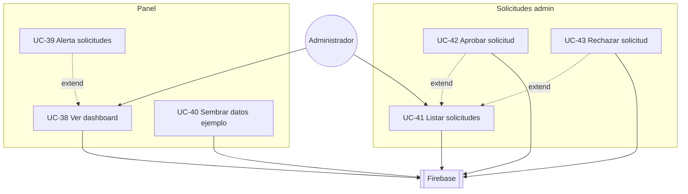

### 7.2 Hoteles y habitaciones (UC-44 – UC-55)

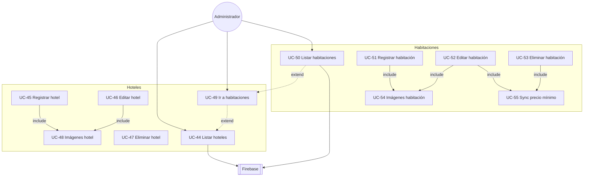

### 7.3 Reservas, cuenta y soporte (UC-56 – UC-65, UC-66)

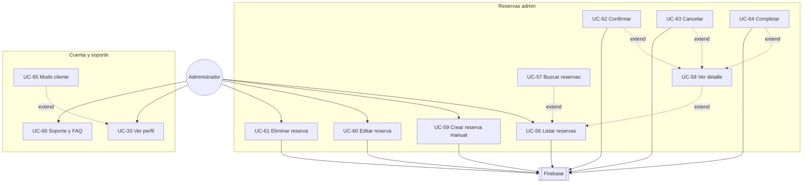

---

## 8. Diagrama UML clásico — Cliente

**Caso central:** `Gestionar reserva ecoturística`

```mermaid
flowchart TB
    subgraph frontera [Sistema Selva Booking]
        UCAcc[Acceder al sistema]
        UCHub[Gestionar reserva ecoturistica]

        subgraph pkgExp [Explorar alojamiento]
            UC11b[Ver inicio]
            UC12b[Buscar hoteles]
            UC15b[Ver detalle hotel]
        end

        subgraph pkgRes [Completar reserva]
            UC18b[Seleccionar fechas]
            UC21b[Crear reserva pendiente]
        end

        subgraph pkgPag [Realizar pago]
            UC22b[Confirmar pago]
            UC26b[Dir. facturación]
        end

        subgraph pkgCon [Consultar reservas]
            UC30b[Listar mis reservas]
        end

        subgraph pkgResenas [Comentarios]
            UC67b[Comentar hotel]
        end

        subgraph pkgCta [Gestionar cuenta]
            UC33b[Ver y editar perfil]
            UC70b[Gestionar método de pago]
        end

        UCExt1[[Cancelar reserva]]
        UCExt2[[Guardar tarjeta]]
    end

    CLI((Cliente)) --> UCAcc
    CLI --> UCHub
    FB[[Firebase]] --> UCHub
    PAY[[Pasarela]] --> UC22b

    UCAcc -->|include| UCHub
    UC11b & UC12b & UC15b --> UCHub
    UC18b & UC21b --> UCHub
    UC22b --> UCHub
    UC30b --> UCHub
    UC67b --> UCHub
    UC33b & UC70b --> UCHub

    UCExt1 -.->|extend| UCHub
    UCExt2 -.->|extend| UC22b
```

---

## 9. Diagrama UML clásico — Administrador

**Caso central:** `Gestionar operaciones admin`

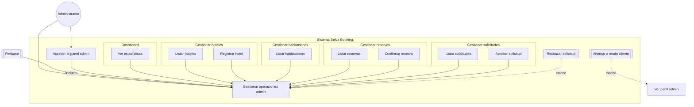

---

## 10. Relaciones include / extend

### Include (obligatorio)

| Caso base | Incluye |
|-----------|---------|
| UC-01 | UC-06 |
| UC-02, UC-03 | UC-07 |
| UC-03 | UC-08, UC-09 |
| UC-04 | UC-10 |
| UC-15 | UC-17 |
| UC-18 | UC-19, UC-20, UC-21 |
| UC-22 | UC-23, UC-24, UC-25, UC-26 |
| UC-30 | UC-31 |
| UC-45, UC-46 | UC-48 |
| UC-51, UC-52 | UC-54 |
| UC-52, UC-53 | UC-55 |
| UC-67 | UC-67a, UC-67b, UC-67c |

### Extend (opcional)

| Caso base | Extiende |
|-----------|----------|
| UC-12 | UC-13, UC-14 |
| UC-15 | UC-16, UC-67 |
| UC-22 | UC-27, UC-28, UC-29 |
| UC-30 | UC-32 |
| UC-33 | UC-34, UC-35, UC-37, UC-65 |
| UC-38 | UC-39 |
| UC-41 | UC-42, UC-43 |
| UC-44 | UC-49 |
| UC-49 | UC-50 |
| UC-56 | UC-57, UC-58 |
| UC-58 | UC-62, UC-63, UC-64 |
| UC-67 | UC-68, UC-69 |

---

## 11. Matriz actor × módulo

| Módulo | Invitado | Cliente | Administrador |
|--------|:--------:|:-------:|:-------------:|
| Autenticación | ●●●● | ● | ● |
| Exploración | — | ●●● | — |
| Reserva y pago | — | ●●●● | — |
| Reseñas | — | ●●● | — |
| Mi cuenta / método de pago | — | ●●●● | — |
| Panel admin | — | — | ●● |
| Solicitudes | — | ○ | ●●● |
| Hoteles / Habitaciones | — | — | ●●●● |
| Reservas admin | — | — | ●●●● |
| Soporte | — | ● | ● |

● acceso directo · ○ indirecto · — no aplica

---

## 12. Archivos PlantUML

Para exportar diagramas UML clásicos como PNG de alta resolución:

| Archivo | Contenido |
|---------|-----------|
| `casos_de_uso_detallado.puml` | Vista general + módulos por separado |
| `casos_de_uso_estilo_uml.puml` | Diagramas detallados Cliente y Admin (hub central) |

```bash
java -jar plantuml.jar docs/diagramas/casos_de_uso_estilo_uml.puml
java -jar plantuml.jar docs/diagramas/casos_de_uso_detallado.puml
```

---

*Fuente: Elaboración propia — Proyecto Selva Booking*
