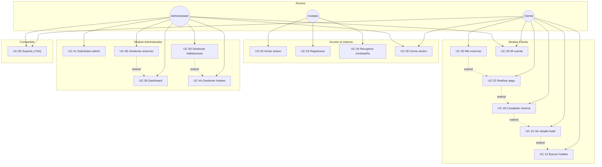
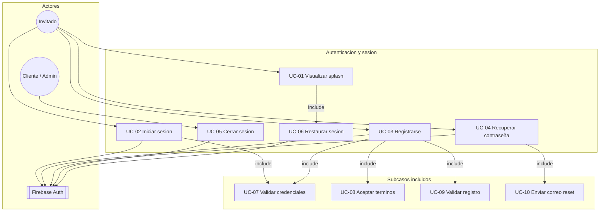
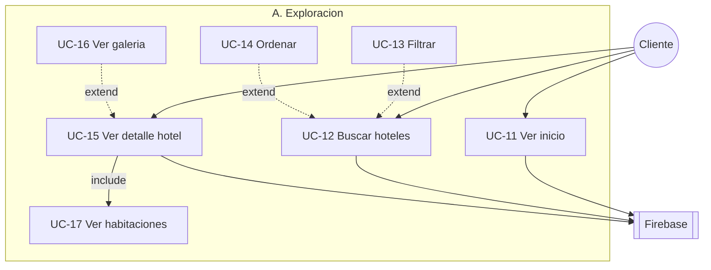
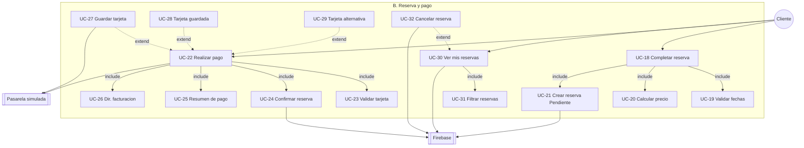
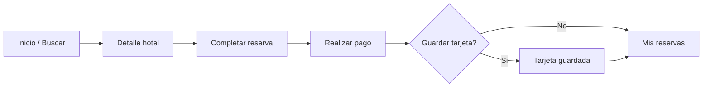
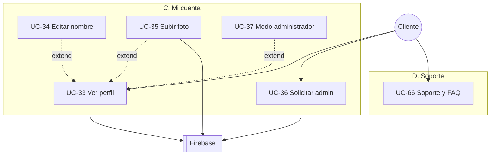
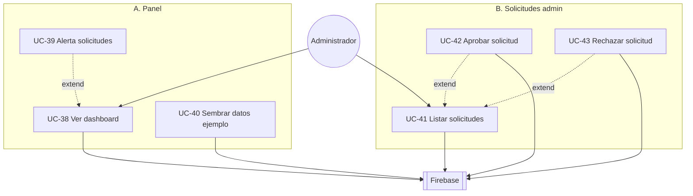
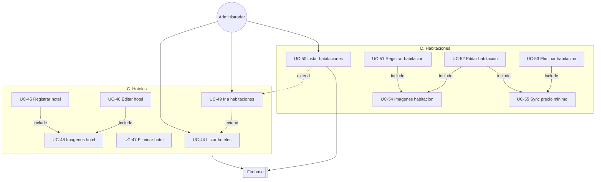
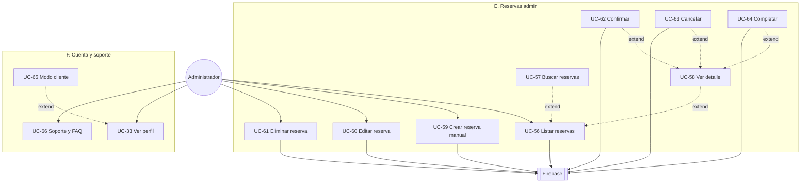

# Diagrama de Casos de Uso — Selva Booking

**Proyecto:** Selva Booking · Android · Kotlin · Firebase  
**Fuente:** Elaboración propia  
**Total:** 66 casos de uso · 5 actores · 4 módulos

> Abre este archivo en **Preview** (`Ctrl+Shift+V`) para ver los diagramas Mermaid.

---

## Índice

1. [Actores](#1-actores)
2. [Diagrama general](#2-diagrama-general)
3. [Módulo 1 — Autenticación](#3-módulo-1--autenticación-uc-01-a-uc-10)
4. [Módulo 2 — Cliente](#4-módulo-2--cliente)
5. [Módulo 3 — Administrador](#5-módulo-3--administrador)
6. [Relaciones include / extend](#6-relaciones-include--extend)
7. [Matriz actor × módulo](#7-matriz-actor--módulo)

---

## 1. Actores

| Actor | Tipo | Descripción |
|-------|------|-------------|
| **Invitado** | Primario | Sin sesión. Splash, login, registro, recuperar contraseña. |
| **Cliente** | Primario | Rol `CLIENTE`. Busca, reserva, paga y gestiona perfil. |
| **Administrador** | Primario | Rol `ADMINISTRADOR`. Gestiona catálogo, reservas y solicitudes. |
| **Firebase** | Secundario | Auth, Firestore y Storage. |
| **Pasarela simulada** | Secundario | Validación local de tarjeta (sin procesador real). |

---

## 2. Diagrama general

Vista resumida de los casos de uso principales por actor.

| ID | Caso de uso | Actor |
|----|-------------|-------|
| UC-02 | Iniciar sesión | Invitado |
| UC-03 | Registrarse | Invitado |
| UC-04 | Recuperar contraseña | Invitado |
| UC-05 | Cerrar sesión | Cliente, Administrador |
| UC-12 | Buscar hoteles | Cliente |
| UC-15 | Ver detalle de hotel | Cliente |
| UC-18 | Completar reserva | Cliente |
| UC-22 | Realizar pago | Cliente |
| UC-30 | Mis reservas | Cliente |
| UC-33 | Mi cuenta | Cliente, Administrador |
| UC-38 | Dashboard | Administrador |
| UC-41 | Solicitudes admin | Administrador |
| UC-44 | Gestionar hoteles | Administrador |
| UC-50 | Gestionar habitaciones | Administrador |
| UC-56 | Gestionar reservas | Administrador |
| UC-66 | Soporte y FAQ | Cliente, Administrador |

---

## 3. Módulo 1 — Autenticación (UC-01 a UC-10)

| ID | Caso de uso | Actor | Descripción |
|----|-------------|-------|-------------|
| UC-01 | Visualizar splash | Invitado | Pantalla de bienvenida al abrir la app. |
| UC-02 | Iniciar sesión | Invitado | Acceso con email y contraseña. |
| UC-03 | Registrarse | Invitado | Creación de cuenta nueva. |
| UC-04 | Recuperar contraseña | Invitado | Enlace de restablecimiento por email. |
| UC-05 | Cerrar sesión | Cliente, Admin | Cierre de sesión Firebase. |
| UC-06 | Restaurar sesión | Sistema | Redirección si hay sesión activa. |
| UC-07 | Validar credenciales | Sistema | Validación de email y contraseña. |
| UC-08 | Aceptar términos | Invitado | Lectura obligatoria antes de registrarse. |
| UC-09 | Validar registro | Sistema | Validación de campos del formulario. |
| UC-10 | Enviar correo reset | Sistema | Email vía Firebase Auth. |

---

## 4. Módulo 2 — Cliente

### 4.1 Exploración (UC-11 a UC-17)

| ID | Caso de uso | Descripción |
|----|-------------|-------------|
| UC-11 | Ver inicio | Destacados, ofertas y recomendados. |
| UC-12 | Buscar hoteles | Búsqueda con filtros y ordenamiento. |
| UC-13 | Filtrar | Ciudad, precio máximo, estrellas. |
| UC-14 | Ordenar | Recomendados, precio o valoración. |
| UC-15 | Ver detalle hotel | Info, galería y habitaciones. |
| UC-16 | Ver galería | Imágenes del hotel. |
| UC-17 | Ver habitaciones | Habitaciones disponibles. |

### 4.2 Reserva y pago (UC-18 a UC-32)

**Flujo principal**

| ID | Caso de uso | Descripción |
|----|-------------|-------------|
| UC-18 | Completar reserva | Fechas y huéspedes. |
| UC-19 | Validar fechas | Fechas y capacidad. |
| UC-20 | Calcular precio | Noches × precio. |
| UC-21 | Crear reserva | Estado **Pendiente**. |
| UC-22 | Realizar pago | Pasarela simulada. |
| UC-23 | Validar tarjeta | Número, vencimiento, CVC. |
| UC-24 | Confirmar reserva | Estado **Confirmada**. |
| UC-25 | Resumen de pago | Hotel, fechas, total. |
| UC-26 | Dir. facturación | Datos de facturación. |
| UC-27 | Guardar tarjeta | Post-pago, futuras reservas. |
| UC-28 | Tarjeta guardada | Pago solo con CVC. |
| UC-29 | Tarjeta alternativa | Nueva tarjeta. |
| UC-30 | Ver mis reservas | Listado personal. |
| UC-31 | Filtrar reservas | Por estado. |
| UC-32 | Cancelar reserva | Cancelación cliente. |

### 4.3 Mi cuenta y soporte (UC-33 a UC-37, UC-66)

| ID | Caso de uso | Descripción |
|----|-------------|-------------|
| UC-33 | Ver perfil | Nombre, email, foto, rol. |
| UC-34 | Editar nombre | Actualizar en Firestore. |
| UC-35 | Subir foto | Firebase Storage. |
| UC-36 | Solicitar admin | Solicitud de acceso admin. |
| UC-37 | Modo administrador | Si `puedeAlternarRol`. |
| UC-66 | Soporte y FAQ | Preguntas frecuentes. |

---

## 5. Módulo 3 — Administrador

### 5.1 Panel y solicitudes (UC-38 a UC-43)

### 5.2 Hoteles y habitaciones (UC-44 a UC-55)

### 5.3 Reservas, cuenta y soporte (UC-56 a UC-65, UC-66)

| Sección | IDs | Casos principales |
|---------|-----|-------------------|
| Panel | UC-38 a UC-40 | Dashboard, alertas, datos ejemplo |
| Solicitudes | UC-41 a UC-43 | Aprobar / rechazar acceso admin |
| Hoteles | UC-44 a UC-49 | CRUD + imágenes + navegar a habitaciones |
| Habitaciones | UC-50 a UC-55 | CRUD + imágenes + sync precio mínimo |
| Reservas | UC-56 a UC-64 | CRUD + confirmar / cancelar / completar |
| Cuenta | UC-33, UC-65, UC-66 | Perfil, alternar rol, soporte |

---

## 6. Relaciones include / extend

### Include (obligatorio)

| Caso base | Incluye |
|-----------|---------|
| UC-01 | UC-06 |
| UC-02, UC-03 | UC-07 |
| UC-03 | UC-08, UC-09 |
| UC-04 | UC-10 |
| UC-15 | UC-17 |
| UC-18 | UC-19, UC-20, UC-21 |
| UC-22 | UC-23, UC-24, UC-25, UC-26 |
| UC-30 | UC-31 |
| UC-45, UC-46 | UC-48 |
| UC-51, UC-52 | UC-54 |
| UC-52, UC-53 | UC-55 |

### Extend (opcional)

| Caso base | Extiende |
|-----------|----------|
| UC-12 | UC-13, UC-14 |
| UC-15 | UC-16 |
| UC-22 | UC-27, UC-28, UC-29 |
| UC-30 | UC-32 |
| UC-33 | UC-34, UC-35, UC-37, UC-65 |
| UC-38 | UC-39 |
| UC-41 | UC-42, UC-43 |
| UC-44 | UC-49 |
| UC-49 | UC-50 |
| UC-56 | UC-57, UC-58 |
| UC-58 | UC-62, UC-63, UC-64 |

---

## 7. Matriz actor × módulo

| Módulo | Invitado | Cliente | Administrador |
|--------|:--------:|:-------:|:-------------:|
| Autenticación | ●●●● | ● | ● |
| Exploración | — | ●●● | — |
| Reserva y pago | — | ●●●● | — |
| Mi cuenta | — | ●●● | — |
| Panel admin | — | — | ●● |
| Solicitudes | — | ○ | ●●● |
| Hoteles / Habitaciones | — | — | ●●●● |
| Reservas admin | — | — | ●●●● |
| Soporte | — | ● | ● |

● acceso directo · ○ indirecto · — no aplica

---

## Archivos relacionados

| Archivo | Uso |
|---------|-----|
| `casos_de_uso_detallado.md` | Este documento (preview Mermaid) |
| `casos_de_uso_detallado.puml` | PlantUML para exportar PNG/PDF |
| `casos_de_uso_00_general.png` | Imagen del diagrama general |
| `casos_de_uso_01_autenticacion.png` | Imagen módulo autenticación |
| `casos_de_uso_02_cliente.png` | Imagen módulo cliente |
| `casos_de_uso_03_administrador.png` | Imagen módulo administrador |

---

*Fuente: Elaboración propia — Proyecto Selva Booking*
