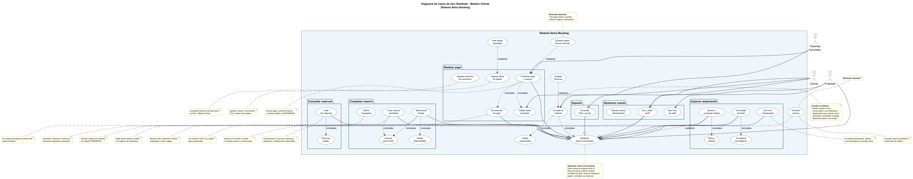
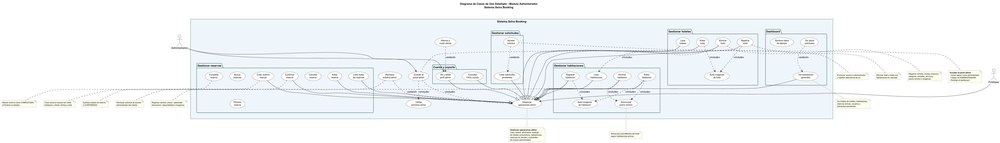

# Diagrama de Casos de Uso Detallado — Selva Booking

**Proyecto:** Selva Booking · Android · Firebase  
**Fuente:** Elaboración propia  
**Formato:** UML clásico (frontera azul, óvalos, actores, `<<include>>`, `<<extend>>`, especialización, notas)

> **Preview:** `Ctrl + Shift + V`  
> **Imágenes grandes:** ver PNG al final de cada módulo.

---

## Índice

1. [Leyenda del diagrama](#1-leyenda-del-diagrama)
2. [Módulo Cliente — diagrama e imágenes](#2-módulo-cliente)
3. [Detalle de casos de uso — Cliente](#3-detalle-de-casos-de-uso--cliente)
4. [Módulo Administrador — diagrama e imágenes](#4-módulo-administrador)
5. [Detalle de casos de uso — Administrador](#5-detalle-de-casos-de-uso--administrador)
6. [Archivos](#6-archivos)

---

## 1. Leyenda del diagrama

| Símbolo | Significado |
|---------|-------------|
| Rectángulo azul claro | **Frontera del sistema** Selva Booking |
| Rectángulos internos | **Paquetes** que agrupan casos relacionados |
| Óvalo superior izquierdo | Caso de **entrada** (acceso al sistema) |
| Óvalo central grande | Caso de uso **principal (hub)** |
| Óvalos inferiores / en paquetes | Casos **especializados** del hub |
| Nota amarilla | **Descripción** de lo que hace el caso de uso |
| Actor izquierdo | Usuario humano (Cliente / Administrador) |
| Actor derecho | Sistema externo (Firebase / Pasarela) |
| `<<include>>` | Subproceso **obligatorio** |
| `<<extend>>` | Flujo **opcional** |
| Flecha con triángulo | **Especialización** hacia el hub central |

---

## 2. Módulo Cliente

### Caso central

**Gestionar reserva ecoturistica** — Agrupa todo el flujo del cliente: explorar hoteles en Madre de Dios, reservar habitación, pagar y consultar sus reservas.

### Diagrama UML (imagen completa)



### Estructura resumida

```
                    [Cancelar reserva]────extend────┐
                    [Guardar tarjeta]──extend──┐    │
                    [Usar tarjeta guardada]    │    │
                                             │    │
[Cliente]──►[Acceder al sistema]──include──►[Gestionar reserva ecoturistica]◄──[Firebase]
                    │ include                      ▲
                    ▼                              │ especializa
              [Validar credenciales]    ┌──────────┴──────────┐
              [Aceptar términos]        │  Paquetes internos  │
                                        └─────────────────────┘
```

---

## 3. Detalle de casos de uso — Cliente

### 3.1 Acceso al sistema

| Caso de uso | Qué hace el sistema |
|-------------|---------------------|
| **Acceder al sistema** | Muestra splash, pantalla de login, registro y recuperación de contraseña. Restaura sesión si el usuario ya estaba autenticado. |
| **Validar credenciales** *(include)* | Verifica formato de email, longitud de contraseña y autentica contra Firebase Auth. |
| **Aceptar términos** *(extend)* | Muestra diálogo scrollable de términos y condiciones; solo permite registrarse al llegar al final y marcar aceptación. |

### 3.2 Explorar alojamiento

| Caso de uso | Qué hace el sistema |
|-------------|---------------------|
| **Ver inicio y destacados** | Carga desde Firestore hoteles destacados, en oferta y recomendados por valoración. |
| **Buscar y comparar hoteles** | Permite buscar por nombre o ciudad y muestra tarjetas con precio, estrellas y rating. |
| **Filtrar y ordenar** *(include de buscar)* | Filtra por ciudad, precio máximo y estrellas; ordena por recomendados, precio o valoración. |
| **Ver detalle de hotel** | Muestra descripción, servicios, ubicación, calificación y listado de habitaciones disponibles. |
| **Ver galería de imágenes** *(include)* | Presenta galería de fotos del hotel con miniaturas seleccionables. |

### 3.3 Completar reserva

| Caso de uso | Qué hace el sistema |
|-------------|---------------------|
| **Seleccionar fechas** | Abre DatePicker para ingreso y salida; muestra resumen del hotel y habitación elegida. |
| **Definir huéspedes** | Control +/- de personas respetando la capacidad máxima de la habitación. |
| **Validar disponibilidad** *(include)* | Comprueba que la fecha de salida sea posterior al ingreso y que los huéspedes no excedan capacidad. |
| **Calcular precio total** *(include)* | Multiplica precio por noche × número de noches y muestra total en barra inferior. |
| **Crear reserva pendiente** | Guarda en Firestore una reserva con estado **PENDIENTE** vinculada al usuario actual. |

### 3.4 Realizar pago

| Caso de uso | Qué hace el sistema |
|-------------|---------------------|
| **Ver resumen de pago** *(include)* | Muestra hotel, habitación, fechas, huéspedes y monto total antes de cobrar. |
| **Ingresar datos de tarjeta** | Formulario con número, MM/AA, CVC y titular; formateo automático al escribir. |
| **Ingresar dirección de facturación** | Captura líneas de dirección, distrito, código postal; país Perú y región Madre de Dios. |
| **Validar datos de tarjeta** *(include)* | Valida número (15–19 dígitos), vencimiento, CVC y campos obligatorios de facturación. |
| **Confirmar pago y reserva** | Simula pasarela (1,5 s), confirma reserva en Firestore como **CONFIRMADA**. |
| **Guardar tarjeta futuras reservas** *(extend)* | Tras pago exitoso, pregunta si desea guardar tarjeta (últimos 4 dígitos + facturación en el dispositivo). |
| **Usar tarjeta guardada** *(extend)* | Precarga datos enmascarados; el cliente solo ingresa CVC para pagar de nuevo. |

**Actor Pasarela simulada:** procesa validación local de tarjeta (sin envío a banco real).

### 3.5 Consultar reservas

| Caso de uso | Qué hace el sistema |
|-------------|---------------------|
| **Listar mis reservas** | Stream en tiempo real de reservas del `userId` autenticado. |
| **Filtrar por estado** *(include)* | Chips para filtrar: Pendiente, Confirmada, Cancelada, Completada. |
| **Cancelar reserva** *(extend del hub)* | Permite cancelar reservas pendientes o confirmadas; actualiza estado en Firestore. |

### 3.6 Gestionar cuenta y soporte

| Caso de uso | Qué hace el sistema |
|-------------|---------------------|
| **Ver y editar perfil** | Muestra nombre, email, rol; permite editar nombre y guardar en Firestore. |
| **Subir foto de perfil** | Selecciona imagen de galería, sube a Firebase Storage y actualiza `fotoUrl`. |
| **Solicitar acceso administrador** | Triple toque en tipo de cuenta; envía solicitud con estado `pendiente`. |
| **Consultar FAQ y ayuda** | Pantalla estática con preguntas frecuentes, email de contacto e instrucciones. |

---

## 4. Módulo Administrador

### Caso central

**Gestionar operaciones admin** — Administra catálogo de hoteles ecoturísticos, habitaciones, reservas de clientes y solicitudes de acceso administrador.

### Diagrama UML (imagen completa)



---

## 5. Detalle de casos de uso — Administrador

### 5.1 Acceso

| Caso de uso | Qué hace el sistema |
|-------------|---------------------|
| **Acceder al panel admin** | Login con rol ADMINISTRADOR y redirección al dashboard. |
| **Validar permisos admin** *(include)* | Verifica rol en Firestore antes de mostrar funciones administrativas. |

### 5.2 Dashboard

| Caso de uso | Qué hace el sistema |
|-------------|---------------------|
| **Ver estadísticas generales** | Totales en vivo: hoteles, habitaciones, reservas activas, usuarios y solicitudes. |
| **Ver alerta solicitudes** *(extend)* | Banner si hay solicitudes de admin pendientes; navega a pantalla de solicitudes. |
| **Sembrar datos de ejemplo** | Si no hay hoteles, inserta catálogo demo desde `SampleData.kt`. |

### 5.3 Gestionar hoteles

| Caso de uso | Qué hace el sistema |
|-------------|---------------------|
| **Listar hoteles** | Stream de todos los hoteles con rating, precio mínimo y flags destacado/oferta. |
| **Registrar hotel** | Formulario: nombre, ciudad, dirección, categoría, estrellas, servicios, precio, imágenes. |
| **Editar hotel** | Precarga datos y permite modificar cualquier campo del hotel. |
| **Eliminar hotel** | Confirmación y borrado en cascada de habitaciones asociadas. |
| **Subir imágenes de hotel** *(include)* | Galería → Firebase Storage (`hoteles/`); agrega URLs al documento. |

### 5.4 Gestionar habitaciones

| Caso de uso | Qué hace el sistema |
|-------------|---------------------|
| **Listar habitaciones** | Habitaciones del hotel seleccionado con precio, capacidad y disponibilidad. |
| **Registrar habitación** | Alta con nombre, precio, capacidad, descripción, disponibilidad e imágenes. |
| **Editar habitación** | Modifica datos existentes de la habitación. |
| **Eliminar habitación** | Borra documento tras confirmación. |
| **Subir imágenes de habitación** *(include)* | Storage en `habitaciones/`. |
| **Sincronizar precio mínimo** *(include)* | Recalcula `precioMinimo` del hotel padre al guardar o eliminar habitación. |

### 5.5 Gestionar reservas

| Caso de uso | Qué hace el sistema |
|-------------|---------------------|
| **Listar todas las reservas** | Stream ordenado por fecha de creación descendente. |
| **Buscar reservas** *(extend)* | Filtro por nombre de hotel, cliente o email. |
| **Crear reserva manual** | Admin ingresa hotel, habitación, cliente, fechas, huéspedes y calcula total. |
| **Editar reserva** | Modifica campos de una reserva existente. |
| **Confirmar reserva** | Cambia estado a **CONFIRMADA**. |
| **Cancelar reserva** | Cambia estado a **CANCELADA**. |
| **Completar reserva** | Cambia estado a **COMPLETADA** al finalizar estadía. |
| **Eliminar reserva** | Borra documento de Firestore tras confirmación. |

### 5.6 Gestionar solicitudes

| Caso de uso | Qué hace el sistema |
|-------------|---------------------|
| **Listar solicitudes pendientes** | Usuarios con `solicitudAdmin = pendiente`. |
| **Aprobar solicitud** *(extend)* | Promueve a ADMINISTRADOR, activa `puedeAlternarRol`, limpia solicitud. |
| **Rechazar solicitud admin** *(extend del hub)* | Marca solicitud como `rechazada`; usuario sigue siendo cliente. |

### 5.7 Cuenta y soporte

| Caso de uso | Qué hace el sistema |
|-------------|---------------------|
| **Ver y editar perfil admin** | Igual que cliente; además puede alternar a modo cliente si tiene permiso. |
| **Alternar a modo cliente** *(extend)* | Cambia rol activo a CLIENTE y navega al home de cliente. |
| **Consultar FAQ y ayuda** | Misma pantalla de soporte compartida con el módulo cliente. |

---

## 6. Archivos

| Archivo | Descripción |
|---------|-------------|
| `casos_de_uso_estilo_uml.md` | Este documento |
| `casos_de_uso_estilo_uml.puml` | Código PlantUML detallado |
| `casos_de_uso_detallado_cliente.png` | Diagrama grande — Cliente |
| `casos_de_uso_detallado_admin.png` | Diagrama grande — Administrador |

### Regenerar imágenes

```bash
java -jar plantuml.jar docs/diagramas/casos_de_uso_estilo_uml.puml
```

---

*Fuente: Elaboración propia — Proyecto Selva Booking*
