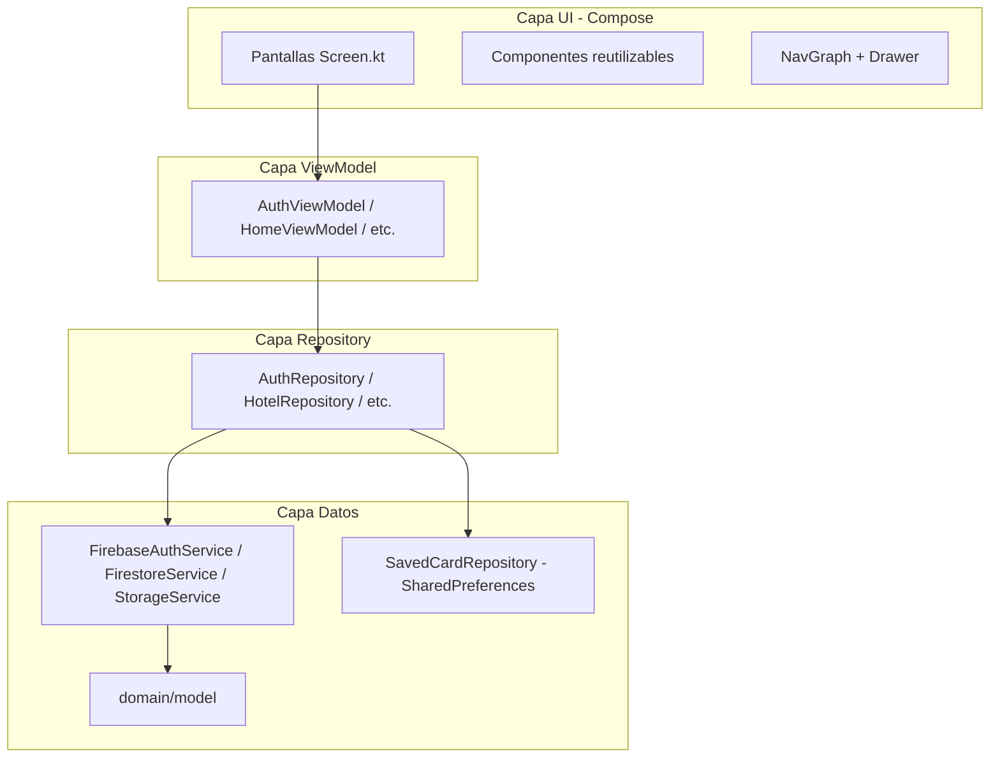

# Bloque 1 — Arquitectura, Stack y Capas del Proyecto

**Integrante:** Persona 1  
**Duración:** 8–10 minutos  
**Objetivo:** Explicar cómo está organizado el código y qué tecnologías usamos.

---

## 1. Qué decir al iniciar (30 seg)

> "Selva Booking es una aplicación Android de reservas ecoturísticas en Madre de Dios. Usamos **Kotlin**, **Jetpack Compose** para la interfaz, patrón **MVVM** para separar responsabilidades y **Firebase** como backend en la nube. El código está dividido en capas claras: UI, ViewModel, Repository, servicios Firebase y modelos de dominio."

---

## 2. Stack tecnológico

| Tecnología | Para qué la usamos |
|------------|-------------------|
| **Kotlin** | Lenguaje principal del proyecto |
| **Jetpack Compose** | Interfaces declarativas (sin XML de layouts) |
| **Material Design 3** | Componentes visuales y tema eco (verde selva) |
| **MVVM** | ViewModel expone estado; la UI solo observa y reacciona |
| **Navigation Compose** | Navegación entre pantallas con rutas tipadas |
| **Firebase Auth** | Login, registro y sesión |
| **Cloud Firestore** | Base de datos en tiempo real |
| **Firebase Storage** | Imágenes de hoteles, habitaciones y perfiles |
| **Coil** | Carga de imágenes desde URL |
| **Coroutines + Flow** | Operaciones asíncronas y datos reactivos |

**Archivo de dependencias:** `app/build.gradle.kts`

---

## 3. Arquitectura en capas



### Regla que seguimos

- La **UI** no llama a Firebase directamente.
- El **ViewModel** no conoce Compose; solo expone `StateFlow` / `UiState`.
- El **Repository** abstrae de dónde vienen los datos (Firestore, Auth, Storage, local).
- Los **modelos** en `domain/model` representan entidades del negocio.

---

## 4. Estructura de carpetas (mostrar en Android Studio)

```
com.company.selvabooking/
├── MainActivity.kt                 ← Punto de entrada
├── SelvaBookingApplication.kt      ← Repositorios globales
├── data/
│   ├── SampleData.kt               ← Datos demo Madre de Dios
│   └── firebase/                   ← Servicios Firebase
├── domain/model/                   ← Hotel, Room, User, Reservation...
├── navigation/                     ← Routes.kt + NavGraph.kt
├── repository/                     ← Capa de acceso a datos
├── ui/
│   ├── admin/                      ← Pantallas administrador
│   ├── auth/                       ← Login, registro
│   ├── client/                     ← Pantallas cliente
│   ├── components/                 ← Botones, campos, tarjetas
│   ├── navigation/                 ← Menú lateral (drawer)
│   ├── profile/                    ← Perfil compartido
│   ├── splash/                     ← Pantalla inicial
│   ├── support/                    ← FAQ
│   └── theme/                      ← Colores y tipografía
├── utils/                          ← Validaciones, fechas, constantes
└── viewmodel/                      ← Lógica de presentación
```

---

## 5. Archivos clave que debes abrir y explicar

### 5.1 Punto de entrada

**`MainActivity.kt`**
- Habilita edge-to-edge (pantalla completa).
- Carga `SelvaBookingTheme` y `SelvaNavGraph()`.

**`SelvaBookingApplication.kt`**
- Crea los repositorios como singletons (`lazy`).
- Todos los ViewModels acceden a datos a través de aquí.

### 5.2 Navegación

**`navigation/Routes.kt`**
- Constantes de rutas: `CLIENT_HOME`, `BOOKING`, `PAYMENT`, `ADMIN_DASHBOARD`, etc.
- Funciones helper: `hotelDetail(id)`, `booking(hotelId, roomId)`.

**`navigation/NavGraph.kt`**
- `NavHost` con todas las pantallas.
- Lógica del **drawer** (menú lateral) según rol cliente o admin.
- Redirección post-login según `UserRole`.

### 5.3 Modelos de dominio

**`domain/model/`** — Abrir y mencionar campos principales:

| Modelo | Campos importantes |
|--------|-------------------|
| `User.kt` | nombre, email, rol, solicitudAdmin, puedeAlternarRol |
| `Hotel.kt` | nombre, ciudad, precioMinimo, estrellas, imagenes, destacado |
| `Room.kt` | hotelId, precio, capacidad, disponible |
| `Reservation.kt` | fechas, huespedes, precioTotal, estado |
| `ReservationStatus.kt` | PENDIENTE, CONFIRMADA, CANCELADA, COMPLETADA |
| `UserRole.kt` | CLIENTE, ADMINISTRADOR |

### 5.4 Utilidades

| Archivo | Función |
|---------|---------|
| `utils/Constants.kt` | Nombres de colecciones Firestore |
| `utils/ValidationUtils.kt` | Validar email, contraseña, tarjeta |
| `utils/DateUtils.kt` | Formato de fechas y moneda (S/) |
| `utils/AuthErrorUtils.kt` | Mensajes de error Firebase en español |

### 5.5 Tema visual

**`ui/theme/Color.kt`** y **`Theme.kt`**
- Paleta eco: verde bosque (`ForestGreen`), crema, fondo logo.
- Identidad visual coherente en toda la app.

---

## 6. Componentes reutilizables (mencionar)

| Componente | Archivo | Uso |
|------------|---------|-----|
| `SelvaScaffold` | `ui/components/SelvaScaffold.kt` | Layout base con top bar |
| `SelvaButton` | `ui/components/SelvaButton.kt` | Botón primario verde |
| `SelvaTextField` | `ui/components/SelvaTextField.kt` | Campo de texto estilizado |
| `LoadingIndicator` | `ui/components/` | Spinner de carga |
| `BookingUiComponents` | `ui/components/BookingUiComponents.kt` | Tarjetas estilo Trivago |

---

## 7. Flujo de datos (ejemplo genérico)

```
Usuario toca botón en pantalla
        ↓
Screen llama viewModel.confirmar()
        ↓
ViewModel valida y llama repository.guardar()
        ↓
Repository llama firestoreService.create(...)
        ↓
Firestore emite cambio → Flow actualiza UiState
        ↓
Compose recomponer pantalla automáticamente
```

---

## 8. Guion de cierre del bloque

> "En resumen: tenemos **68 archivos Kotlin** organizados en capas MVVM. La UI está en `ui/`, la lógica en `viewmodel/`, el acceso a datos en `repository/` y Firebase en `data/firebase/`. El siguiente compañero explicará cómo el usuario entra al sistema con autenticación y roles."

---

## 9. Preguntas frecuentes que pueden hacer

| Pregunta | Respuesta |
|----------|-----------|
| ¿Por qué MVVM? | Separa UI de lógica; facilita pruebas y mantenimiento |
| ¿Por qué Compose y no XML? | Código Kotlin declarativo, menos archivos, estado reactivo |
| ¿Dónde está la base de datos local? | No usamos Room; todo en Firestore excepto tarjeta guardada (SharedPreferences) |
| ¿Cuántas pantallas tiene? | 18 pantallas Compose + componentes compartidos |

---

*Fuente: Elaboración propia — Bloque 1 de 4*
