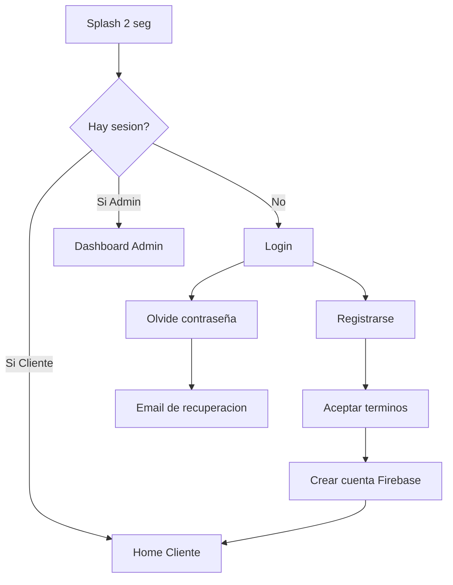

# Bloque 2 — Autenticación, Perfil y Roles

**Integrante:** Persona 2  
**Duración:** 8–10 minutos  
**Objetivo:** Explicar cómo el usuario entra al sistema, acepta términos, gestiona su perfil y puede convertirse en administrador.

---

## 1. Qué decir al iniciar (30 seg)

> "Antes de reservar, el usuario debe autenticarse. Implementamos registro con **términos y condiciones obligatorios**, login con Firebase Auth, recuperación de contraseña y un sistema de **roles** (Cliente y Administrador) con solicitud y aprobación de acceso admin."

---

## 2. Pantallas de este bloque

| Pantalla | Archivo | Ruta |
|----------|---------|------|
| Splash | `ui/splash/SplashScreen.kt` | `splash` |
| Login | `ui/auth/AuthScreens.kt` | `login` |
| Registro | `ui/auth/AuthScreens.kt` | `register` |
| Olvidé contraseña | `ui/auth/AuthScreens.kt` | `forgot_password` |
| Términos y condiciones | `ui/auth/TermsAndConditions.kt` | (diálogo en registro) |
| Perfil | `ui/profile/ProfileScreen.kt` | `client_profile` / `admin_profile` |

---

## 3. Flujo de autenticación



---

## 4. Archivos que debes abrir y explicar

### 4.1 AuthViewModel — cerebro de la autenticación

**`viewmodel/AuthViewModel.kt`**

| Función | Qué hace |
|---------|----------|
| `login()` | Valida email/clave → Firebase Auth → carga perfil Firestore |
| `register()` | Valida campos + términos → crea usuario Auth + documento en `usuarios` |
| `logout()` | Cierra sesión Firebase |
| `sendPasswordReset()` | Envía email de recuperación |
| `updateCurrentUser()` | Actualiza usuario en memoria tras cambio de rol |

**Estado expuesto:** `AuthUiState` con `isAuthenticated`, `currentUser`, `termsAccepted`, errores.

### 4.2 AuthRepository — capa de datos

**`repository/AuthRepository.kt`**

- Coordina `FirebaseAuthService`, `FirestoreService` y `StorageService`.
- Al registrar: si falla Firestore, **revierte** el usuario de Auth (rollback).
- `seedSampleDataIfNeeded()`: si no hay hoteles, carga datos demo de Madre de Dios.
- Promoción automática de admin designado (`AdminUtils.kt`).

### 4.3 Firebase Auth Service

**`data/firebase/FirebaseAuthService.kt`**

```kotlin
// Operaciones principales:
signIn(email, password)
signUp(email, password)
signOut()
sendPasswordReset(email)
authStateFlow()  // escucha cambios de sesion en tiempo real
```

### 4.4 Pantallas de auth

**`ui/auth/AuthScreens.kt`**

- **LoginScreen:** email, contraseña, enlaces a registro y recuperación.
- **RegisterScreen:** nombre, email, contraseña, confirmación, **checkbox términos**.
- **ForgotPasswordScreen:** envío de email reset.

**Validaciones:** email válido, contraseña mínimo 6 caracteres, nombre mínimo 3 caracteres.

### 4.5 Términos y condiciones

**`ui/auth/TermsAndConditions.kt`**

- Diálogo **scrollable** con 9 secciones legales.
- Botón "Aceptar" **deshabilitado** hasta llegar al final del texto.
- Checkbox en registro solo se activa tras leer términos.
- Incluye cláusula de **pasarela de pagos simulada**.

### 4.6 Perfil y roles

**`viewmodel/ProfileViewModel.kt`** + **`ui/profile/ProfileScreen.kt`**

| Función | Descripción |
|---------|-------------|
| Editar nombre | Guarda en Firestore |
| Subir foto | Galería → Firebase Storage → URL en perfil |
| Solicitar admin | Triple toque en "Tipo de cuenta" → `solicitudAdmin = pendiente` |
| Alternar rol | Si `puedeAlternarRol` → cambia CLIENTE ↔ ADMINISTRADOR |

**Modelo User (`domain/model/User.kt`):**
- `rol`: CLIENTE o ADMINISTRADOR
- `solicitudAdmin`: pendiente / rechazada / null
- `puedeAlternarRol`: true si admin aprobó alternancia

---

## 5. Modelo de usuario en Firestore

**Colección:** `usuarios`

```json
{
  "nombre": "Juan Pérez",
  "email": "juan@email.com",
  "telefono": "",
  "fotoUrl": "https://...",
  "rol": "CLIENTE",
  "solicitudAdmin": "pendiente",
  "puedeAlternarRol": false
}
```

**Mostrar en Firebase Console** durante la exposición.

---

## 6. Seguridad y validación

| Archivo | Responsabilidad |
|---------|-----------------|
| `utils/ValidationUtils.kt` | isValidEmail, isValidPassword, isValidName |
| `utils/AuthErrorUtils.kt` | Traduce errores Firebase a mensajes claros |

---

## 7. Demo sugerida (2 min)

1. Mostrar **registro** → abrir términos → scroll hasta el final → aceptar → crear cuenta.
2. Mostrar documento creado en **Firestore → usuarios**.
3. En perfil: **solicitar acceso admin** (triple toque).
4. Mencionar que Persona 4 mostrará la **aprobación** en panel admin.

---

## 8. Guion de cierre

> "Con esto el usuario ya puede entrar al sistema de forma segura, aceptando términos legales. El perfil permite personalización y solicitud de rol administrador. A continuación verán el flujo completo del **cliente** para buscar y reservar hoteles."

---

## 9. Preguntas frecuentes

| Pregunta | Respuesta |
|----------|-----------|
| ¿Las contraseñas dónde se guardan? | Firebase Auth (hasheadas); nosotros no las almacenamos |
| ¿Se puede usar sin cuenta? | No; todo el flujo requiere autenticación |
| ¿Cómo se aprueba un admin? | Admin existente en `AdminRequestsScreen` (Bloque 4) |

---

*Fuente: Elaboración propia — Bloque 2 de 4*
