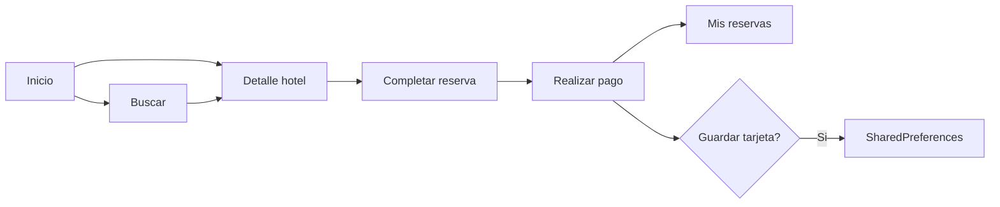
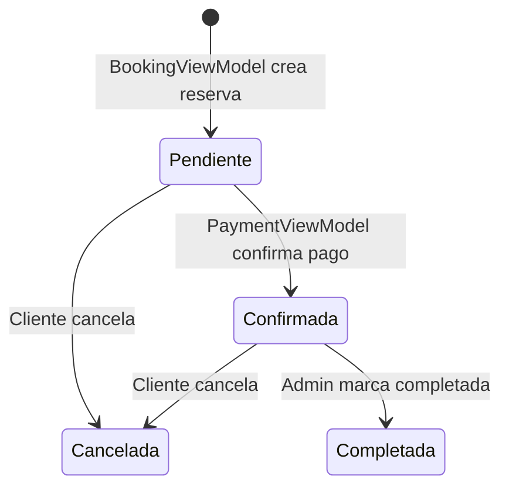

# Bloque 3 — Módulo Cliente (Reserva y Pago)

**Integrante:** Persona 3  
**Duración:** 10–12 minutos  
**Objetivo:** Explicar el flujo completo del cliente: buscar hoteles, reservar, pagar y consultar reservas.

---

## 1. Qué decir al iniciar (30 seg)

> "El corazón de Selva Booking es la experiencia del **cliente**: explorar lodges y hoteles en Madre de Dios, comparar precios estilo Trivago, completar una reserva con fechas y huéspedes, pagar con una **pasarela simulada** y consultar sus reservas en tiempo real."

---

## 2. Pantallas del módulo cliente

| Pantalla | Archivo | ViewModel |
|----------|---------|-----------|
| Inicio | `ui/client/HomeScreen.kt` | `HomeViewModel.kt` |
| Buscar | `ui/client/SearchScreen.kt` | `SearchViewModel.kt` |
| Detalle hotel | `ui/client/HotelDetailScreen.kt` | `HotelDetailViewModel.kt` |
| Completar reserva | `ui/client/BookingScreen.kt` | `BookingViewModel.kt` |
| Pago | `ui/client/PaymentScreen.kt` | `PaymentViewModel.kt` |
| Mis reservas | `ui/client/MyReservationsScreen.kt` | `MyReservationsViewModel.kt` |

**Componentes compartidos:** `ui/components/BookingUiComponents.kt`, `HotelCard.kt`, `PaymentTextFields.kt`

---

## 3. Flujo completo del cliente



---

## 4. Bloque A — Exploración (Inicio, Buscar, Detalle)

### HomeViewModel + HomeScreen

**`viewmodel/HomeViewModel.kt`**
- Escucha hoteles en tiempo real desde Firestore.
- Separa listas: **destacados**, **ofertas**, **recomendados** (por rating).
- Barra de búsqueda rápida que redirige a SearchScreen.

**`ui/client/HomeScreen.kt`**
- Carruseles horizontales de hoteles.
- Acceso rápido a reservas y búsqueda.

### SearchViewModel + SearchScreen

**`viewmodel/SearchViewModel.kt`**

| Filtro | Campo |
|--------|-------|
| Texto libre | nombre o ciudad |
| Ciudad | filtro exacto |
| Precio máximo | precioMinimo ≤ valor |
| Estrellas mínimas | estrellas ≥ valor |
| Ordenamiento | recomendados / precio / rating |

**`ui/client/SearchScreen.kt`**
- Barra de búsqueda redondeada estilo Trivago.
- Filtros colapsables.
- Tarjetas `HotelOfferCard` con imagen, estrellas, badge rating, precio "desde/noche".

### HotelDetailViewModel + HotelDetailScreen

**`viewmodel/HotelDetailViewModel.kt`**
- Carga hotel por `hotelId` + habitaciones con `disponible == true`.
- Índice de imagen seleccionada en galería.

**`ui/client/HotelDetailScreen.kt`**
- Imagen hero con degradado.
- Badge de calificación (Excelente, Muy bueno...).
- Galería de miniaturas.
- Chips de servicios.
- Tarjetas de habitación con botón **Reservar**.
- Barra inferior fija con precio mínimo.

---

## 5. Bloque B — Completar reserva

### BookingViewModel + BookingScreen

**`viewmodel/BookingViewModel.kt`**

| Paso | Lógica |
|------|--------|
| Cargar datos | Hotel + habitación desde Firestore |
| Fechas | DatePicker ingreso/salida |
| Huéspedes | +/- respetando `capacidad` |
| Validación | Salida > ingreso; huéspedes ≤ capacidad |
| Precio | `noches × precioHabitacion` |
| Crear reserva | Estado **PENDIENTE** en Firestore |

**`ui/client/BookingScreen.kt`**
- Resumen del hotel con imagen.
- Tarjetas de fecha (`BookingDateCard`).
- Control de huéspedes.
- Resumen de precio.
- Barra inferior sticky "Reservar ahora".

**Archivo clave al abrir:**
```kotlin
// BookingViewModel.kt - crear reserva
reservationRepository.createReservation(reservation)
// estado inicial: ReservationStatus.PENDIENTE
```

---

## 6. Bloque C — Pago simulado

### PaymentViewModel + PaymentScreen

**`viewmodel/PaymentViewModel.kt`**

| Funcionalidad | Detalle |
|---------------|---------|
| Cargar reserva | Por `reservationId` desde Firestore |
| Validar tarjeta | Número 15–19 dígitos, MM/AA, CVC 3–4 |
| Tarjeta guardada | Precarga datos; solo pide CVC |
| Otra tarjeta | Formulario completo alternativo |
| Simular pago | Delay 1,5 segundos |
| Confirmar | Cambia reserva a **CONFIRMADA** |
| Guardar tarjeta | Post-pago → SharedPreferences (últimos 4 dígitos) |

**`ui/client/PaymentScreen.kt`**
- Resumen de pago (hotel, fechas, total).
- Formulario pasarela (tarjeta, facturación Perú / Madre de Dios).
- Selector tarjeta guardada vs nueva tarjeta.
- Pantalla éxito + pregunta "¿Guardar tarjeta?".

**Archivos de soporte:**
- `repository/SavedCardRepository.kt` — almacenamiento local
- `domain/model/SavedPaymentCard.kt` — modelo enmascarado
- `utils/PaymentInputFormatters.kt` — formato número tarjeta sin saltos de cursor
- `ui/components/PaymentTextFields.kt` — campos especializados

> **Importante decir:** "No usamos Stripe ni procesador real. Es simulación educativa; no se envía PAN completo a ningún servidor."

---

## 7. Bloque D — Mis reservas

### MyReservationsViewModel + MyReservationsScreen

**`viewmodel/MyReservationsViewModel.kt`**
- Stream de reservas filtradas por `userId`.
- Filtro por estado: Pendiente, Confirmada, Cancelada, Completada.
- `cancelReservation()`: solo Pendiente o Confirmada → estado Cancelada.

**`ui/client/MyReservationsScreen.kt`**
- Lista en tiempo real.
- Chips de filtro (`ReservationStatusFilterRow`).
- Tarjetas con hotel, fechas, total y badge de estado.

---

## 8. Estados de una reserva



**Modelo:** `domain/model/ReservationStatus.kt`

---

## 9. Demo sugerida (3 min)

1. **Buscar** "Puerto Maldonado" o hotel demo.
2. Abrir **detalle** → elegir habitación → **Reservar**.
3. Seleccionar fechas + huéspedes → **Reservar ahora**.
4. Completar **pago** → mostrar confirmación.
5. Ir a **Mis reservas** → ver estado CONFIRMADA en Firestore.

---

## 10. Guion de cierre

> "El cliente puede explorar, comparar, reservar y pagar en un flujo continuo. Los datos se sincronizan en Firestore en tiempo real. El siguiente bloque muestra cómo el **administrador** gestiona hoteles, habitaciones y reservas desde el panel."

---

## 11. Preguntas frecuentes

| Pregunta | Respuesta |
|----------|-----------|
| ¿El pago es real? | No; simulación con validación local |
| ¿Dónde se guarda la tarjeta? | Solo en el dispositivo (SharedPreferences), enmascarada |
| ¿Qué pasa si no paga? | La reserva queda PENDIENTE hasta confirmar o cancelar |

---

*Fuente: Elaboración propia — Bloque 3 de 4*
