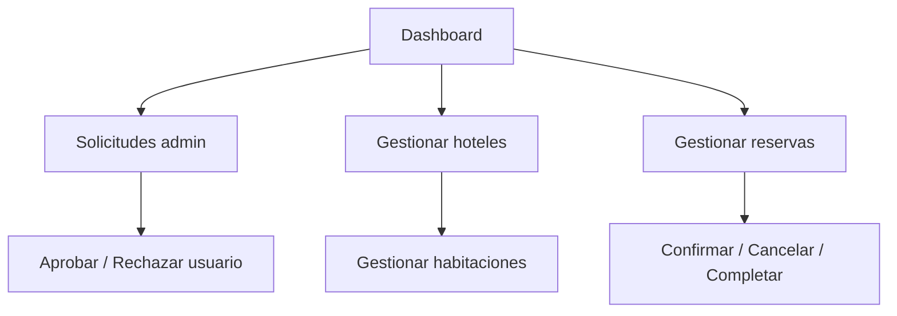
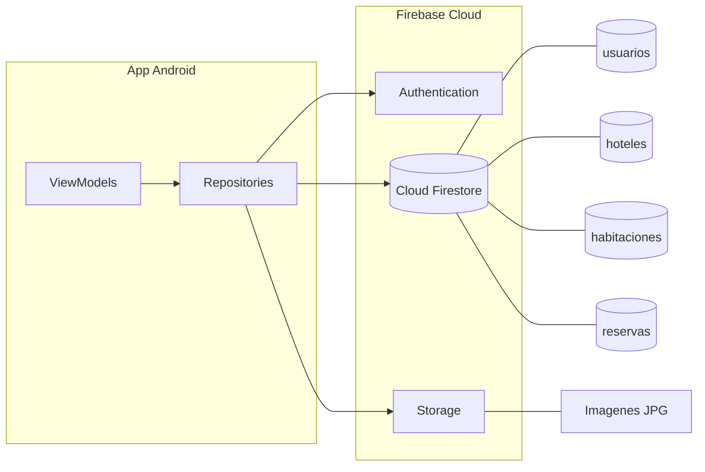

# Bloque 4 — Módulo Administrador y Firebase

**Integrante:** Persona 4  
**Duración:** 10–12 minutos  
**Objetivo:** Explicar el panel admin, CRUD de hoteles/habitaciones/reservas, solicitudes de admin y la capa Firebase.

---

## 1. Qué decir al iniciar (30 seg)

> "El administrador gestiona todo el ecosistema: ve estadísticas en un dashboard, aprueba solicitudes de acceso admin, administra hoteles y habitaciones con imágenes en Firebase Storage, y controla todas las reservas. Todo persiste en **Cloud Firestore** en tiempo real."

---

## 2. Pantallas del módulo admin

| Pantalla | Archivo | ViewModel |
|----------|---------|-----------|
| Dashboard | `ui/admin/AdminDashboardScreen.kt` | `AdminDashboardViewModel.kt` |
| Solicitudes admin | `ui/admin/AdminRequestsScreen.kt` | `AdminRequestsViewModel.kt` |
| Hoteles | `ui/admin/AdminHotelsScreen.kt` | `AdminHotelsViewModel.kt` |
| Habitaciones | `ui/admin/AdminRoomsScreen.kt` | `AdminRoomsViewModel.kt` |
| Reservas | `ui/admin/AdminReservationsScreen.kt` | `AdminReservationsViewModel.kt` |

**Menú lateral:** `ui/navigation/NavigationDrawer.kt` — items distintos para admin vs cliente.

---

## 3. Flujo del administrador



---

## 4. Bloque A — Dashboard

### AdminDashboardViewModel + AdminDashboardScreen

**`viewmodel/AdminDashboardViewModel.kt`**

Estadísticas en tiempo real:
- Total hoteles
- Total habitaciones
- Total reservas
- Reservas activas (Pendiente + Confirmada)
- Total usuarios
- Solicitudes admin pendientes

**`ui/admin/AdminDashboardScreen.kt`**
- Grid de tarjetas KPI (`StatCard`).
- Banner de alerta si hay solicitudes pendientes.
- Al cargar: ejecuta `seedSampleDataIfNeeded()` si Firestore está vacío.

**Datos demo:** `data/SampleData.kt`
- Hoteles ecoturísticos de Puerto Maldonado, Tambopata, etc.
- Habitaciones con precios en soles (S/).

---

## 5. Bloque B — Solicitudes de administrador

### AdminRequestsViewModel + AdminRequestsScreen

**Conecta con Bloque 2** (solicitud del cliente en perfil).

| Acción | Efecto en Firestore |
|--------|---------------------|
| **Aprobar** | `rol = ADMINISTRADOR`, `puedeAlternarRol = true`, limpia solicitud |
| **Rechazar** | `solicitudAdmin = rechazada` |

**Query:** usuarios con `solicitudAdmin == "pendiente"` (stream en tiempo real).

**Demo:** Aprobar la solicitud que Persona 2 creó en la demo.

---

## 6. Bloque C — CRUD Hoteles y Habitaciones

### AdminHotelsViewModel + AdminHotelsScreen

**`viewmodel/AdminHotelsViewModel.kt`**

| Operación | Detalle |
|-----------|---------|
| Listar | Stream de todos los hoteles |
| Crear | Diálogo inline con formulario completo |
| Editar | Precarga datos del hotel seleccionado |
| Eliminar | Confirmación + **cascada** (borra habitaciones del hotel) |
| Imágenes | Sube a Storage `hoteles/` y guarda URLs |

**Campos del hotel:** nombre, ciudad, dirección, descripción, categoría, estrellas, precio mínimo, rating, servicios, destacado, oferta.

### AdminRoomsViewModel + AdminRoomsScreen

**En el mismo archivo:** `AdminHotelsViewModel.kt` (clase `AdminRoomsViewModel`)

| Operación | Detalle |
|-----------|---------|
| Listar | Habitaciones filtradas por `hotelId` |
| Crear / Editar | nombre, precio, capacidad, descripción, disponible |
| Eliminar | Borra documento de habitación |
| Imágenes | Storage `habitaciones/` |
| Sync precio | Recalcula `precioMinimo` del hotel padre |

**Navegación:** `admin_rooms/{hotelId}` desde lista de hoteles.

---

## 7. Bloque D — CRUD Reservas

### AdminReservationsViewModel + AdminReservationsScreen

**`viewmodel/AdminReservationsViewModel.kt`**

| Operación | Descripción |
|-----------|-------------|
| Listar | Todas las reservas ordenadas por fecha |
| Buscar | Por hotel, nombre cliente o email |
| Filtrar | Por estado |
| Crear manual | Admin ingresa todos los campos |
| Editar | Modifica reserva existente |
| Eliminar | Borra documento |
| Confirmar | → CONFIRMADA |
| Cancelar | → CANCELADA |
| Completar | → COMPLETADA |

**Conexión con Bloque 3:** Las reservas que el cliente crea aparecen aquí automáticamente (Firestore listeners).

---

## 8. Capa Firebase (mostrar código)

### FirestoreService — el núcleo de datos

**`data/firebase/FirestoreService.kt`**

**Colecciones** (`utils/Constants.kt`):

| Colección | Documentos |
|-----------|------------|
| `usuarios` | Perfiles de usuario |
| `hoteles` | Catálogo de alojamientos |
| `habitaciones` | Habitaciones (campo `hotelId`) |
| `reservas` | Reservas con nombres desnormalizados |

**Operaciones típicas:**
```kotlin
// Tiempo real - la UI se actualiza sola
fun getHotelsFlow(): Flow<List<Hotel>>
fun getReservationsFlow(): Flow<List<Reservation>>

// Escritura
suspend fun createReservation(reservation: Reservation)
suspend fun updateReservationStatus(id, status)
suspend fun deleteHotel(id)  // cascada habitaciones
```

### StorageService — imágenes

**`data/firebase/StorageService.kt`**

| Carpeta | Contenido |
|---------|-----------|
| `hoteles/` | Fotos de hoteles |
| `habitaciones/` | Fotos de habitaciones |
| `perfiles/` | Fotos de perfil de usuario |

### Repositories — abstracción

| Repository | Usa |
|------------|-----|
| `HotelRepository.kt` | Firestore + Storage |
| `RoomRepository.kt` | Firestore + Storage |
| `ReservationRepository.kt` | Firestore |
| `AuthRepository.kt` | Auth + Firestore + Storage |

---

## 9. Diagrama Firebase completo



**Mostrar Firebase Console en vivo:** Auth → Users, Firestore → colecciones, Storage → carpetas.

---

## 10. Repositorios y modelos (tabla resumen)

| Entidad | Modelo | Repository | Pantallas que la usan |
|---------|--------|------------|----------------------|
| Usuario | `User.kt` | `AuthRepository` | Login, Perfil, Solicitudes |
| Hotel | `Hotel.kt` | `HotelRepository` | Home, Search, Admin Hotels |
| Habitación | `Room.kt` | `RoomRepository` | Detail, Booking, Admin Rooms |
| Reserva | `Reservation.kt` | `ReservationRepository` | Booking, Payment, Admin/Client reservations |

---

## 11. Demo sugerida (3 min)

1. Abrir **Dashboard** → mostrar KPIs.
2. **Aprobar solicitud** admin (si Persona 2 la creó).
3. **Editar hotel** → subir imagen → ver en Storage.
4. Ir a **habitaciones** → cambiar precio → ver `precioMinimo` actualizado.
5. **Reservas** → buscar la reserva de la demo de Persona 3 → marcar **Completada**.

---

## 12. Documentación de diagramas

Mencionar que el equipo documentó **66 casos de uso** en:
- `docs/diagramas/casos_de_uso_estilo_uml.md`
- `docs/diagramas/casos_de_uso_detallado_cliente.png`
- `docs/diagramas/casos_de_uso_detallado_admin.png`

---

## 13. Guion de cierre final del equipo

> "Selva Booking integra una app Android moderna con backend Firebase serverless. El cliente reserva ecoturismo en Madre de Dios; el administrador gestiona todo el catálogo y las reservas en tiempo real. Usamos MVVM, Compose y buenas prácticas de separación de capas. ¿Preguntas?"

---

## 14. Preguntas frecuentes

| Pregunta | Respuesta |
|----------|-----------|
| ¿Por qué Firestore y no MySQL? | Tiempo real, sin servidor propio, integración nativa con Android |
| ¿Hay reglas de seguridad Firestore? | Se pueden configurar en Firebase Console (mencionar si están en proyecto) |
| ¿Qué pasa si borro un hotel? | Se eliminan sus habitaciones en cascada (`FirestoreService`) |
| ¿Cuántos roles hay? | Dos: CLIENTE y ADMINISTRADOR, con alternancia opcional |

---

*Fuente: Elaboración propia — Bloque 4 de 4*
