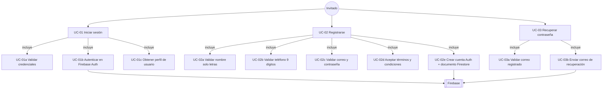
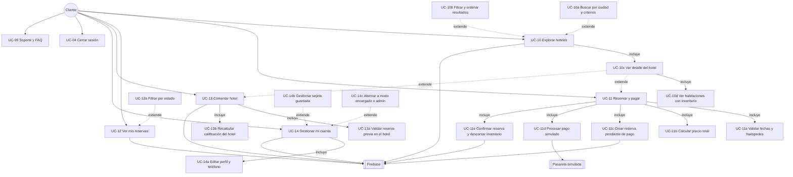
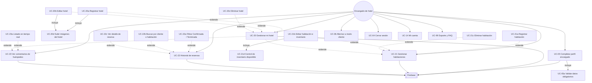
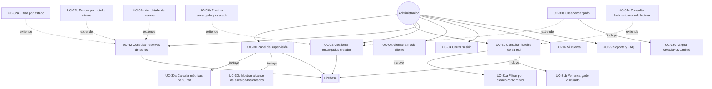

# Casos de uso detallados por rol

Diagramas UML con relaciones **`<<incluye>>`** (subproceso obligatorio) y **`<<extiende>>`** (flujo opcional).

> **PlantUML (recomendado para exportar):** archivos `01a` … `01e` en esta carpeta.  
> **Mermaid:** ver secciones siguientes (vista previa en Markdown).

---

## 1. Invitado

**PlantUML:** [`01a_casos_uso_invitado.puml`](01a_casos_uso_invitado.puml)

| ID | Caso de uso | Tipo | Descripción |
|----|-------------|------|-------------|
| UC-01 | Iniciar sesión | Principal | Acceso con correo y contraseña |
| UC-01a | Validar credenciales | incluye | Campos no vacíos, formato correo |
| UC-01b | Autenticar Firebase | incluye | `signIn` en Firebase Auth |
| UC-01c | Obtener perfil | incluye | Lee documento `usuarios/{id}` |
| UC-02 | Registrarse | Principal | Alta de cliente |
| UC-02a–e | Validaciones y persistencia | incluye | Nombre, teléfono, términos, Firestore |
| UC-03 | Recuperar contraseña | Principal | Restablecimiento por correo |
| UC-03a–b | Validar y enviar | incluye | Correo válido + email Firebase |

---

## 2. Cliente

**PlantUML:** [`01b_casos_uso_cliente.puml`](01b_casos_uso_cliente.puml)

---

## 3. Encargado de hotel

**PlantUML:** [`01c_casos_uso_encargado.puml`](01c_casos_uso_encargado.puml)

---

## 4. Administrador (limitado)

**PlantUML:** [`01d_casos_uso_administrador.puml`](01d_casos_uso_administrador.puml)

---

## 5. SuperAdmin

```mermaid
flowchart TB
    SA((SuperAdmin))
    FB[[Firebase]]

    UC30S[UC-30s Panel global]
    UC30SA[UC-30sa Métricas ingresos y reservas]
    UC30SB[UC-30sb Hoteles sin encargado / sin admin]
    UC30SC[UC-30sc Total comentarios globales]

    UC31S[UC-31s Gestionar hoteles y habitaciones]
    UC31A[UC-31a Crear / editar / eliminar hotel]
    UC31B[UC-31b Filtrar hoteles por administrador]
    UC31C[UC-31c CRUD habitaciones e inventario]
    UC31D[UC-31d Ver encargado y administrador vinculado]
    UC36[UC-36 Ver comentarios por hotel]

    UC32S[UC-32s Gestionar reservas globales]
    UC32A[UC-32a Crear reserva manual]
    UC32B[UC-32b Editar o eliminar reserva]
    UC32C[UC-32c Filtrar y buscar reservas]
    UC32D[UC-32d Terminar reserva anticipada]

    UC33S[UC-33s Gestionar todos los encargados]
    UC34[UC-34 Gestionar administradores]
    UC34A[UC-34a Crear cuenta administrador]
    UC34B[UC-34b Eliminar administrador]

    UC35[UC-35 Auditoría del sistema]
    UC35A[UC-35a Consultar registro de cambios]
    UC35B[UC-35b Revertir cambio de encargado]

    UC06[UC-06 Alternar a modo cliente]
    UC04[UC-04 Cerrar sesión]
    UC14[UC-14 Mi cuenta]
    UC99[UC-99 Soporte y FAQ]

    SA --> UC30S & UC31S & UC32S & UC33S & UC34 & UC35 & UC06 & UC04 & UC14 & UC99
    UC30S -->|incluye| UC30SA & UC30SB & UC30SC
    UC31A & UC31B & UC31C & UC31D & UC36 -.->|extiende| UC31S
    UC32A & UC32B & UC32C & UC32D -.->|extiende| UC32S
    UC34A & UC34B -.->|extiende| UC34
    UC35 -->|incluye| UC35A
    UC35B -.->|extiende| UC35
    UC31S -.->|extiende| UC36
    UC30S & UC31S & UC32S & UC33S & UC34 & UC35 & UC36 --> FB
```

**PlantUML:** [`01e_casos_uso_superadmin.puml`](01e_casos_uso_superadmin.puml)

---

## Leyenda

| Relación | Significado | Notación PlantUML |
|----------|-------------|-------------------|
| **incluye** | Subproceso obligatorio del caso base | `..> : <<incluye>>` |
| **extiende** | Variante u opción del caso base | `..> : <<extiende>>` |
| Actor → caso | El actor inicia o participa en el caso | `-->` |

---

*Fuente: Elaboración propia — Proyecto Selva Booking*
