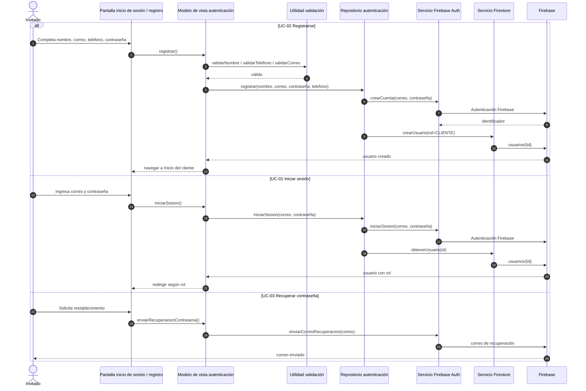
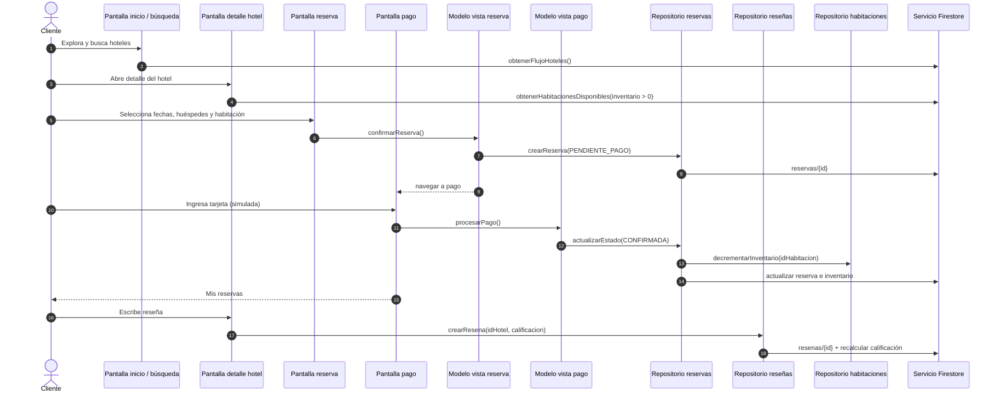
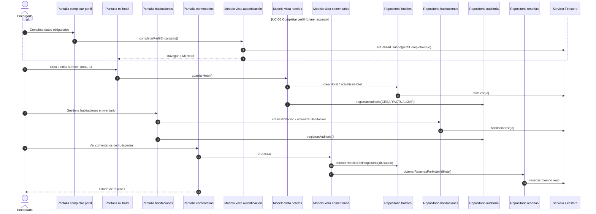
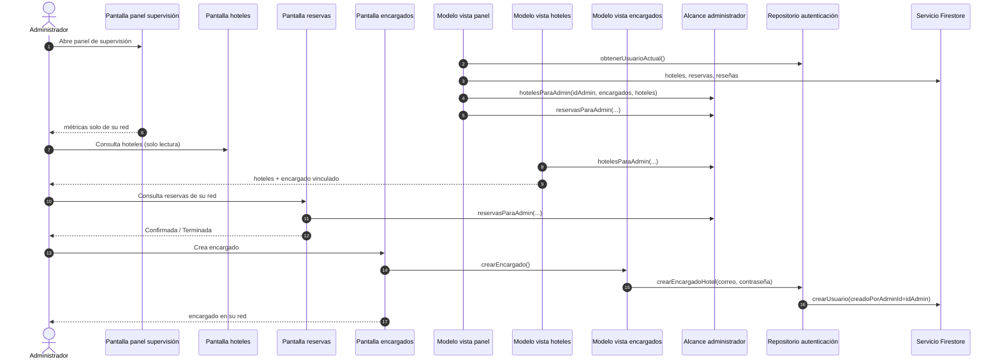
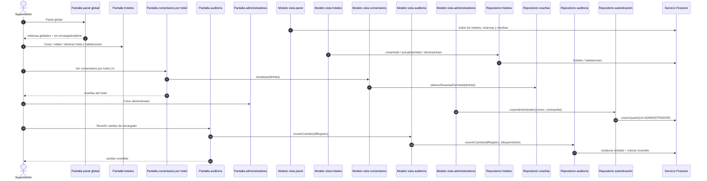
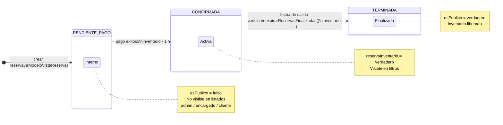
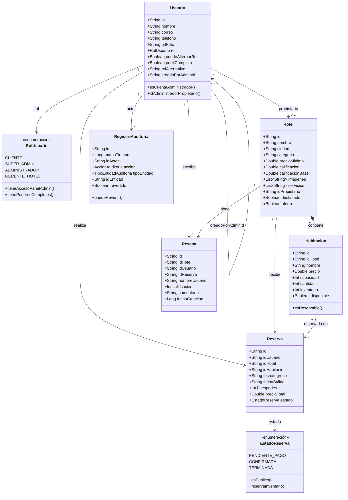
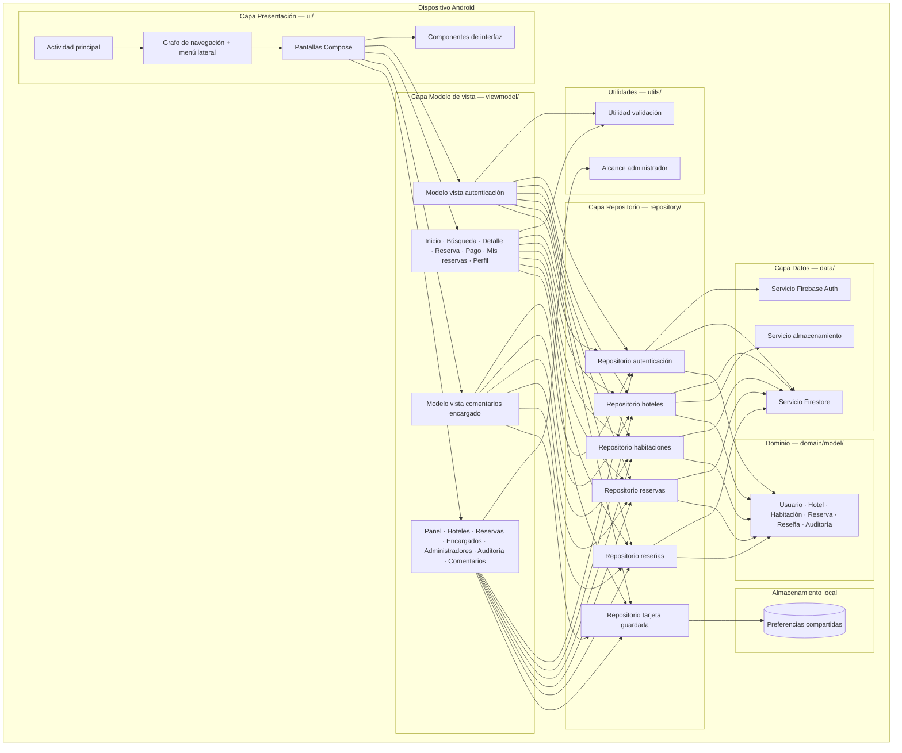
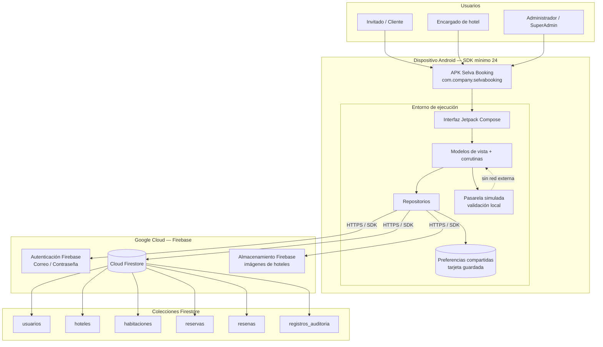

# Selva Booking — Diagramas UML del proyecto

**Proyecto:** Selva Booking · Android (Kotlin · Jetpack Compose · MVVM) · Firebase  
**Versión:** Julio 2026 · Idioma: español  
**Carpeta:** `docs/uml/`

> Abre este archivo con **Preview** (`Ctrl + Shift + V`) para ver los diagramas Mermaid.  
> Para exportar PNG/SVG: `java -jar plantuml.jar docs/uml/*.puml`  
> **Imágenes generadas:** [`imagenes/`](imagenes/) (PNG listos para documentación)

---

## 1. Diagrama de casos de uso

Actores: **Invitado**, **Cliente**, **Encargado de hotel**, **Administrador** (limitado), **SuperAdmin**, **Firebase** y **Pasarela simulada**.

```mermaid
flowchart TB
    subgraph actores [Actores]
        INV((Invitado))
        CLI((Cliente))
        ENC((Encargado de hotel))
        ADM((Administrador))
        SA((SuperAdmin))
    end

    subgraph externos [Sistemas externos]
        FB[[Firebase]]
        PAY[[Pasarela simulada]]
    end

    subgraph sistema [Sistema Selva Booking]

        subgraph auth [Autenticación]
            UC01[UC-01 Iniciar sesión]
            UC02[UC-02 Registrarse]
            UC03[UC-03 Recuperar contraseña]
            UC04[UC-04 Cerrar sesión]
            UC05[UC-05 Completar perfil encargado]
            UC06[UC-06 Alternar rol]
        end

        subgraph cliente [Módulo Cliente]
            UC10[UC-10 Explorar y buscar hoteles]
            UC11[UC-11 Reservar y pagar]
            UC12[UC-12 Mis reservas]
            UC13[UC-13 Comentar hotel]
            UC14[UC-14 Mi cuenta]
        end

        subgraph encargado [Módulo Encargado]
            UC20[UC-20 Gestionar mi hotel]
            UC21[UC-21 Gestionar habitaciones e inventario]
            UC22[UC-22 Historial de reservas]
            UC23[UC-23 Ver comentarios]
        end

        subgraph adminLim [Administrador limitado]
            UC30[UC-30 Panel de supervisión]
            UC31L[UC-31 Consultar hoteles de su red]
            UC32L[UC-32 Consultar reservas de su red]
            UC33L[UC-33 Gestionar encargados creados]
        end

        subgraph superAdmin [SuperAdmin]
            UC30S[UC-30s Panel global]
            UC31S[UC-31s Gestionar hoteles y habitaciones]
            UC32S[UC-32s Gestionar reservas]
            UC33S[UC-33s Gestionar encargados]
            UC34[UC-34 Gestionar administradores]
            UC35[UC-35 Auditoría y revertir cambios]
            UC36[UC-36 Comentarios por hotel]
        end

        UC99[UC-99 Soporte y preguntas frecuentes]
    end

    INV --> UC01 & UC02 & UC03
    CLI --> UC04 & UC10 & UC11 & UC12 & UC13 & UC14 & UC99
    ENC --> UC04 & UC05 & UC06 & UC20 & UC21 & UC22 & UC23 & UC14 & UC99
    ADM --> UC04 & UC06 & UC30 & UC31L & UC32L & UC33L & UC14 & UC99
    SA --> UC04 & UC06 & UC30S & UC31S & UC32S & UC33S & UC34 & UC35 & UC36 & UC14 & UC99

    UC01 & UC02 & UC03 & UC04 & UC05 --> FB
    UC10 & UC11 & UC12 & UC13 & UC14 --> FB
    UC20 & UC21 & UC22 & UC23 --> FB
    UC30 & UC31L & UC32L & UC33L --> FB
    UC30S & UC31S & UC32S & UC33S & UC34 & UC35 & UC36 --> FB
    UC11 --> PAY

    UC11 -.->|extiende| UC10
    UC23 -.->|extiende| UC20
    UC36 -.->|extiende| UC31S
```



**PlantUML:** [`01_casos_de_uso.puml`](01_casos_de_uso.puml)

### 1.1 Casos de uso detallados por rol

Diagramas con relaciones **`<<incluye>>`** y **`<<extiende>>`** para cada actor:

| Rol | Documento | PlantUML |
|-----|-----------|----------|
| Invitado | [01_casos_uso_por_rol.md §1](01_casos_uso_por_rol.md) | [`01a_casos_uso_invitado.puml`](01a_casos_uso_invitado.puml) |
| Cliente | [§2](01_casos_uso_por_rol.md) | [`01b_casos_uso_cliente.puml`](01b_casos_uso_cliente.puml) |
| Encargado de hotel | [§3](01_casos_uso_por_rol.md) | [`01c_casos_uso_encargado.puml`](01c_casos_uso_encargado.puml) |
| Administrador limitado | [§4](01_casos_uso_por_rol.md) | [`01d_casos_uso_administrador.puml`](01d_casos_uso_administrador.puml) |
| SuperAdmin | [§5](01_casos_uso_por_rol.md) | [`01e_casos_uso_superadmin.puml`](01e_casos_uso_superadmin.puml) |

```bash
java -jar plantuml.jar docs/uml/01a_casos_uso_invitado.puml docs/uml/01b_casos_uso_cliente.puml docs/uml/01c_casos_uso_encargado.puml docs/uml/01d_casos_uso_administrador.puml docs/uml/01e_casos_uso_superadmin.puml
```

---

## 2. Diagramas de secuencia (por actor)

### 2.1 Invitado — Registro e inicio de sesión



**PlantUML:** [`02a_secuencia_invitado.puml`](02a_secuencia_invitado.puml)

---

### 2.2 Cliente — Reservar, pagar y comentar



**PlantUML:** [`02b_secuencia_cliente.puml`](02b_secuencia_cliente.puml)

---

### 2.3 Encargado de hotel — Gestionar hotel, habitaciones y comentarios



**PlantUML:** [`02c_secuencia_encargado.puml`](02c_secuencia_encargado.puml)

---

### 2.4 Administrador — Supervisión de su red



**PlantUML:** [`02d_secuencia_administrador.puml`](02d_secuencia_administrador.puml)

---

### 2.5 SuperAdmin — Control global y auditoría



**PlantUML:** [`02e_secuencia_superadmin.puml`](02e_secuencia_superadmin.puml)

**PlantUML combinado:** [`02_secuencia.puml`](02_secuencia.puml)

---

## 3. Diagrama de estados

Estados del ciclo de vida de una **reserva** y su impacto en el **inventario** de la habitación.



| Estado | Cliente | Admin / SuperAdmin | Encargado | Inventario |
|--------|:-------:|:------------------:|:---------:|:----------:|
| Pendiente de pago | Durante pago | No | No | Sin cambio |
| Confirmada | Sí | Sí | Sí (su hotel) | −1 |
| Terminada | Sí | Sí | Sí (su hotel) | +1 |

**PlantUML:** [`03_estados.puml`](03_estados.puml)

---

## 4. Diagrama de clases

Modelo de dominio principal (`domain/model/`).



**PlantUML:** [`04_clases.puml`](04_clases.puml)

---

## 5. Diagrama de componentes

Arquitectura **MVVM** del proyecto Android.



**PlantUML:** [`05_componentes.puml`](05_componentes.puml)

---

## 6. Diagrama de despliegue

Distribución física: **aplicación Android** en el dispositivo del usuario y **servicios Firebase** en la nube.



| Nodo | Tecnología | Responsabilidad |
|------|------------|-----------------|
| APK Android | Kotlin · Compose · MVVM | Interfaz, lógica de negocio, navegación |
| Preferencias compartidas | Almacenamiento local Android | Tarjeta de pago simulada guardada |
| Autenticación Firebase | Google Cloud | Registro, inicio de sesión, recuperación de contraseña |
| Cloud Firestore | Google Cloud | Persistencia de usuarios, hoteles, reservas, reseñas y auditoría |
| Almacenamiento Firebase | Google Cloud | Imágenes de hoteles subidas por encargados |
| Pasarela simulada | En la aplicación | Validación de tarjeta sin procesador real |

**PlantUML:** [`06_despliegue.puml`](06_despliegue.puml)

---

## Exportar diagramas

```bash
# Todos los diagramas
java -jar plantuml.jar docs/uml/*.puml

# Solo casos de uso por rol
java -jar plantuml.jar docs/uml/01a_casos_uso_invitado.puml docs/uml/01b_casos_uso_cliente.puml docs/uml/01c_casos_uso_encargado.puml docs/uml/01d_casos_uso_administrador.puml docs/uml/01e_casos_uso_superadmin.puml

# Solo secuencias por actor
java -jar plantuml.jar docs/uml/02a_secuencia_invitado.puml docs/uml/02b_secuencia_cliente.puml docs/uml/02c_secuencia_encargado.puml docs/uml/02d_secuencia_administrador.puml docs/uml/02e_secuencia_superadmin.puml
```

Genera PNG/SVG en la misma carpeta `docs/uml/`.

---

*Fuente: Elaboración propia — Proyecto Selva Booking*
